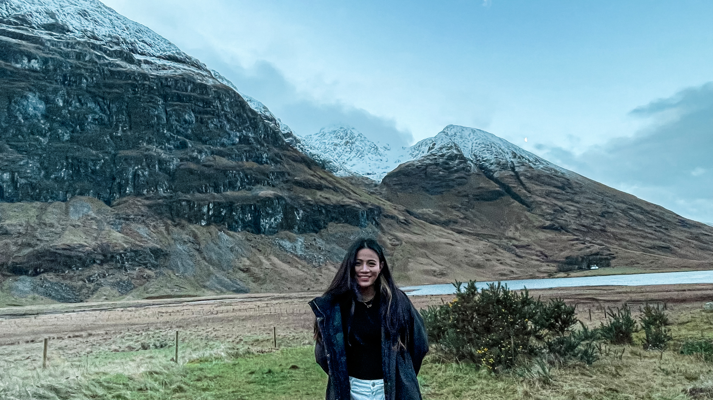

# Introduction

Welcome to group 22. Our final idea is *Doodle Jump*.

## Homework
- [v] [Paper prototype video](./IMG_0837.MOV)
- [v] [Class diagram](./DoodleJump_class_diagram.png)
- [v] [Egg with face](./EggWithFace.pde)
- [v] Doodle Jump foundation code ([DoodleJumpInit](./DoodleJumpInit/))

# Team Members

- Joyee Tan

<!--  -->

- Shannon Lin

<!--  -->

- Zefeng Zhuang
