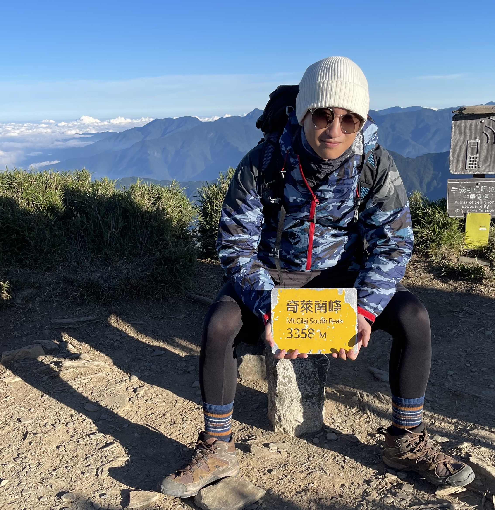

# Introduction

Our primary goal during the planning phase of our video game brief was to capture a modern, recognizable brand that was flexible and approachable to every kind of user. As a result, early discussions shifted away from more traditional forms of arcade gaming such as Pac-Man or Space Invaders. Instead, group ideas that were shortlisted sought to capture the instantly identifiable nostalgia of games that we, as video game players ourselves, grew up with. Our game finally coalesced into a platforming video game, providing a twist on the original iPhone game Doodle Jump. The platforming aspect of Doodle Jump provided the perfect combination of simple, easy-to-pick-up game mechanics as well as the ability to implement a diverse range of gameplay twists. In our game you control your ‘doodle’, a customizable player character whose main objective is to steadily climb higher through a randomly generated environment. While doing so, players will encounter several obstacles whose goal is to slow down or defeat the player. These obstacles include different types of platforms such as ghost ledges, which cause the player to fall straight through, or single-use platforms that disappear when stepped on. Obstacles also include active enemies who spawn at varying intervals throughout the map, attempting to end the current user’s game. At the player’s disposal are several powerful abilities or ‘equipment’ that encourage fast-moving platforming, such as spring mechanisms and jetpack boosts. What distinguishes our game from other implementations of platforming games and Doodle Jump itself is the introduction of core game-play twists. These include:

1.	dynamic map manipulation by players that allows for exciting in-game problem solving

2.	gravity inversion that shifts gameplay away from traditional platforming and towards a race-against-the-clock style

3.	a competitive two-player version that pits users against each other in an ‘elimination-style’ twist on the Doodle Jump formula

# Requirements

## Ideation process
During the ideation process, our team focused on brainstorming potential game ideas that met specific constraints to ensure that the game we create was feasible to develop, has a good user appeal, and adheres to specific constraints.

To better understand what users may be interested in, we started by creating user stories. 

"As young student, I want a game that is easy to undestand and yet challenging to play during my break time."

"As a working professional, I want a game doesn't require internet connection, playable with one hand, quick, fun, and engaging game to play during commute."

To adhere to these constraints, we generated five game ideas, including chess, checkers, flappy bird, temple run, and doodle jump. We then evaluated these ideas based on their features, technical feasibility, and potential appeal to users.

We considered several features during our evaluation process, including whether the game was static or dynamic and whether it relied on strategy or reflexes. After careful consideration and by creating more user stories, 

"As a single player, I want to be able to enjoy a game without relying on oher players."

"As a player, I want a game that are challenging and require different levels of skill and strategy to master."

we eliminated the two static game ideas and opted for a dynamic and reflex-based game as we believed they are more appealing to users.

Next, we evaluated the remaining game ideas' technical feasibility and concluded that Doodle Jump was the most feasible game to develop. This was because the game has simple mechanics where the player only needs to jump from one platform to another, which does not require complex physics simulations or pathfinding algorithms like Temple Run or Flappy Bird. Doodle Jump also has a minimalist art style that doesn’t require detailed graphics or animations, which makes it easier for developers to create the necessary assets for the game. The game also only scrolls vertically, reducing the technical complexity of implementing scrolling.

After deciding on Doodle Jump as our final game, we brainstormed possible twists to make the game more thrilling. Ultimately, we settled on three ideas: Helping Platform, Gravity Reverse, and Two-Player PK Mode.

## Early stages design

Once we decided on creating a game based on Doodle Jump with three twists, we began the early stages of design. Our first step was to identify the core game mechanics and functionality needed for the game. We conducted research with paying particular attention to games with similar mechanics to Doodle Jump. This research helped us to identify the key game mechanics we needed to incorporate, such as jumping and avoiding obstacles.

Next, we developed a use case diagram to help us visualize the core use cases and actors involved in the game. This diagram helped us to identify the primary use cases and actors, and how they interacted with one another. We included the use cases for the basic version of Doodle Jump, as well as the three twists we planned to add. We also identified the actors involved in the game, including the player, broken platforms and monsters.
<figure>
  
  <figcaption>Base Game Use Case Diagram</figcaption>
</figure>

<figure>
  
  <figcaption>Use Case Diagram with Twist</figcaption>
</figure>
 
 
After developing the use case diagram, we created a paper prototype of the game.

<figure>
  
  <figcaption>Paper Prototype</figcaption>
</figure>
 
 
This prototype helped us to refine our design ideas and iterate on the game mechanics. We experimented with different layouts, color schemes, and game mechanics to see what worked best. We also discuss and identify any potential issues or improvements. Through this process, we were able to make the necessary adjustments and refine our game design.

One of the key challenges we faced during the early stages of design was balancing the difficulty level of the game. We wanted the game to be challenging enough to keep players engaged, but not so difficult that it would frustrate them. We experimented with different platforms, monsters, and gameplay mechanics to find the right balance.

Overall, the early stages of design were crucial in helping us to refine our game concept and identify the key features and functionality required for our game. By developing a use case diagram and a paper prototype, we were able to visualize the game mechanics and iterate on our design ideas. This process helped us to create a solid foundation for the development of our game.

# Design

## System Architecture
The game’s architecture consists of three main components: the Game Manager, User Interface, and the Game Elements. These components work together to create a cohesive and engaging gaming experience.

<strong>Game Manager</strong>
 
Our "main" file acts as a Game Manager. The Game Manager is responsible for managing the overall game flow, including updating the game state, generating new game elements, and handling user input. It plays a crucial role in ensuring that the game runs smoothly and responds to user actions in a timely and appropriate manner.

For user input, we decided to use the left and right arrow keys as the main moving keys, as they are more intuitive than other options. Additionally, the 'z' key can be used to spawn a helping platform under the Doodler, and the 'space' key can be used to restart the game when it's game over. These user inputs are carefully chosen to provide a seamless and enjoyable gaming experience.

<strong>User Interface</strong>
 
We have five classes as our user interface components: start page, setting window, help window, pause window, and end page. The User Interface is designed to be easy to use and visually appealing, providing a seamless and enjoyable gaming experience for the user.

While acting as game manager, the "main" also plays a role in rendering the main game screen, which displays the player's score, as well as buttons for pausing the game. The start page consists of a help window button and a setting window button at the left and right top corner, respectively. It displays the game's title, choices of character, and a start button. The help window provides instructions for users to understand the game, while users can choose level difficulty and switch to 2-player mode in the setting window. In the end page, the final score is shown in single player mode, whereas in two-player mode, the winner is shown.

<strong>Game Elements</strong>
 
The Game Elements component includes all of the game objects, such as Doodler, monsters, and platforms. Each of these game elements is implemented as a separate class, with its own set of properties and methods. These elements are carefully designed to be visually appealing and challenging, providing a fun and engaging gaming experience for the user.

The Doodler is the main character of the game, and is designed to be easy to control and visually appealing. The monsters and platforms provide a challenging obstacle for the Doodler to overcome, adding an element of excitement and difficulty to the game.

## Class Diagram

<figure>
  
  <figcaption>Class Diagram</figcaption>
</figure>
 
 
To create a clear and organized system for Doodle Jump, we've designed a class diagram that includes different pages and windows as classes to help players navigate and understand the game.

First, we have the Start Page class, which players see when they open the game. This class allows players to choose their character and provides access to two auxiliary windows: the Setting Window and the Help Window. The Setting Window allows players to adjust the number of players and difficulty level, while the Help Window provides guidance on how to play the game. These pages are designed to enhance user control and freedom.

During gameplay, there are four important classes: Doodle, Platform, Equipment, and Monster. The objective is to help the Doodle jump as high as possible, while avoiding falling off the screen or colliding with monsters. Equipments can help the Doodle jump higher and gain points more efficiently, but can also lead to collisions with monsters. To implement these features, we've designed three interactions: Doodle & Platform, Doodle & Equipment, and Doodle & Monster.

When the Doodle touches a platform, it can jump to a specific level. When it touches equipment, it can jump higher, but must avoid colliding with monsters. In addition, three twists have been incorporated to change the gameplay slightly. The first twist is the Two-Player Mode, where players try to jump higher than each other, while avoiding monsters. The second twist is the Gravity Reverse Mode, where the objective is to move down the stairs without jumping on platforms, while avoiding spikes on the ceiling. Finally, the Helping Platform Mechanism allows players to generate a platform just below the Doodle under specific conditions, to save it from falling off the screen.

Lastly, the End Page class appears only when the game is over. Here, players can choose to start a new game or exit the game. Additionally, a Pause Window will appear if the player pauses the game, informing them of their paused status. By organizing the game into different windows and pages, we've created a clear and intuitive system for players to navigate and understand Doodle Jump.

## Sequence Diagram

<figure>
  
  <figcaption>Sequence Diagram</figcaption>
</figure>
 
 
Above is the sequence diagram for our game. The sequence diagram shows the interactions between the different components of the game, including the player, the platforms, the monsters, and the score system. First of all, the game generates various types of platforms randomly, including normal, fragile, broken, spring, and rocket platforms. Each platform provides different feedback to the doodler based on its characteristics.

When the player moves the doodler to the left or right, the doodler can land on a platform, and the platform will provide feedback to the doodler. The normal platform and fragile platform both return the "jump" feedback, but the fragile platform will disappear at the same time. On the other hand, the broken platform will not provide any feedback but disappear when the doodler interacts with it. The spring platform and rocket platform provide different types of jumps. The spring platform helps the doodler to jump higher, while the rocket reduces gravity, allowing the doodler to fly.
In addition to the different types of platforms, there are also empty areas where there are no platforms for the doodler to land on. When this happens, the game constantly checks whether the doodler is out of the window. If the doodler is out of the window, the game is over. Furthermore, monsters will appear at random times, intervals, and places. If the doodler touches a monster, the game is also over.

If the player is good enough to reach a certain score, a gravity reverse is triggered, causing the player to go down instead of jumping to avoid touching the ceiling spike. If the doodler touches the ceiling spike, the game is over.

# Implementation

## Platforming Framework
Implementing the early platforming logic of the player character and the surrounding objects proved to be relatively straightforward in their design.  Writing our game in Processing allowed us to straightforwardly generate player characters, manipulate their velocity, and implement simple collision detection between the user and the surrounding platform. The first challenge that emerged in our game implementation was designing the nature of our randomly generated map, in particular, cycling through successfully navigated parts of the map. One problem that seemed to emerge among other project groups was the difficulty in translating the map and its obstacles to the movement of the user. Our game structure navigated these problems by ensuring that the platform entities (and in turn the equipment and monster entities) were all instantiated within the Doodler class. This allowed us to manipulate these objects in a way that responded to the current configuration of the player character. This also presented a novel solution to a secondary problem that immediately impacted platforming performance and memory allocation. When the map failed to adequately react to the movement of the player the large number of platform, equipment, and monster entities being spawned caused map generation errors, hardware lag, and eventual crashing. By successfully implementing a reactive map generation process, our software was able to identify when parts of the map had been successfully traversed and were therefore being rendered off-screen. In doing so we were able to purge navigated entities that no longer needed to be rendered ensuring a smooth, efficient game execution.

## Gameplay Twists
Having implemented a basic platforming method that represented the underlying framework for the rest of our software, the next development challenge was the incorporation of the gameplay twist elements. Developing our two-player game mode presented several challenges, particularly in its integration with the base game model. The two-player method required tweaking how user inputs were registered, allowing for multiple key presses and directional changes among the two users. Creating this alternate game state for two players also required a careful rebalancing of equipment objects. Preliminary feedback recognised that powerful changes to a doodle’s velocity and map position, which caused games to end prematurely, threatened the fairness and enjoyment of the game mode. As a result, alterations were made to interactions with equipment to lessen their impact and the method behind map generation was altered slightly to favour whichever doodle was traversing fastest.

## Integration and UI
Alongside our two-player game mode, our group endeavoured to develop and refine two other gameplay twists, which also included a reversed gravity mode and the ability for the user to directly manipulate the map layout. Laid out alongside our basic platforming framework, the final challenge required us to combine these disparate packages into one complete product. Important considerations throughout this process were the need to not only create tidy, easy-to-read code for us as developers but an equally accessible user interface for our players. While also remaining keenly aware of how we wanted to structure our game difficulty sections. Our gameplay twists, as well as features such as map enemies, significantly altered the difficulty level of a simple platformer. We, therefore, wanted to create an interface for our game that communicated our gameplay twists to the user, while also allowing for features to be added or removed for certain difficulty levels, all at the discretion of the player. The solution was to implement a layered interface that allowed users to both select single and multiplayer game modes, as well as adjust the difficulty of the map they faced. Subsequently, each incremental difficulty level would enable a new, more challenging gameplay twist.

# Evaluation
## Think Aloud Evaluation:
We set up six different tasks related to a game, including accessing the help page, adjusting the difficulty level, achieving a certain score, pausing the game, returning to the home page after game over, and engaging in a two-player competition.
### Stage 1: Pre-Update Evaluation
The initial evaluation highlighted some critical usability issues, such as a lack of clear instructions, difficulty level options, and an unintuitive pause mechanism. Players also expressed a desire for power-ups and bonus items, and improvements in the two-player mode to include different game modes.
### Stage 2: First Update Evaluation
After the first update, the evaluation showed that adding a platform under the doodler when the game started, preventing game over on spawn, was a significant improvement. Players also appreciated the addition of an instruction page and different difficulty levels. However, some minor usability issues remained, such as the lack of a more obvious button and more information on the game over screen.
### Stage 3: Second Update Evaluation
Following the second update, the evaluation indicated further improvements in the game's usability. Players found the Help page informative and well-organized, and they appreciated the varying difficulty levels. They noted the game's challenging nature and enjoyed the unique style, even though it occasionally made it difficult to see certain objects. The pause button and navigation to the Home screen after losing were deemed user-friendly. Finally, the two-player mode was seen as a fun addition that could benefit from clearer character tracking and improved controls.
## Heuristic Evaluation:
### Stage 1: Pre-Update Evaluation
Before any updates, the heuristic evaluation by students identified several issues in the game, such as unclear system status, lack of user control and freedom, inadequate recognition rather than recall, insufficient error prevention, and limited flexibility and efficiency of use. Students suggested various possible solutions to address these issues, including clearer feedback, better instructions or tutorials, and customizable controls or interfaces.
### Stage 2: First Update Evaluation
After the first update, some issues were addressed, such as the game over on spawn problem and the addition of the instruction page and different difficulty levels. However, other usability issues remained, such as the lack of an obvious pause button and more information on the game over screen.
### Stage 3: Second Update Evaluation
Following the second update, the Heuristic Evaluation indicated significant improvements in the game's usability. Students noted that many of their previous concerns were addressed, including continuous broken platform issues, gravity reverse platform color inconsistencies, and extended transition times. Moreover, the game over screen could benefit from clearer visualizations for "space" and character differentiation in the two-player mode. Overall, the second update demonstrated considerable progress in addressing previously identified heuristic issues.

## System Usability Scale & NASA Task Load Index:
To assess the impact of the game updates on usability and workload, we conducted a series of Wilcoxon tests on the System Usability Scale (SUS) scores and the NASA Task Load Index (TLX) scores before and after each update.
### Stage 1: Before updates:
Before any updates were implemented, the game had certain usability issues and players experienced a higher workload. The initial SUS and NASA TLX scores reflected these problems.
### Stage 2: After first update:
Following the first update, a significant improvement in the SUS scores was observed, indicating that the implemented changes positively impacted the game's usability. In terms of the NASA TLX scores, the results showed a decrease in the perceived workload, suggesting that the game had become more accessible and less demanding for players after the first update.
### Stage 3: After second update:
After the second update, another Wilcoxon test was conducted to compare the SUS scores, resulting in a W-value of 1.5. This result further demonstrates that the game's usability has continued to improve with the second update. Similarly, the NASA TLX scores showed another decrease in the perceived workload, indicating that the game updates have made the game even more accessible and less demanding for players.

Our game is analyzed through a three-stage evaluation process, including System Usability Scale & NASA TLX, Think Aloud Evaluation, and Heuristic Evaluation. Two updates significantly improved game usability and user experience by addressing issues such as unclear system status, user control, and error prevention. The updates also enhanced gameplay with the addition of an instruction page and different difficulty levels.

The Think Aloud Evaluation revealed that users appreciated the informative Help page, challenging difficulty levels, and enjoyable 2-player mode, but suggested improvements for the free player inputs and score display. Heuristic Evaluation showed substantial progress in addressing heuristic issues, with only minor concerns remaining. Overall, the updates have created a more engaging, user-friendly, and accessible gaming experience.

## Description of how code was tested
In the development of our Doodle Jump game, we tested the code thoroughly by modifying functions within the code to output relevant information when the mouse cursor interacted with specific locations in the game. This information was logged in a file, allowing us to analyze the log file and identify valid and invalid operations.

The game consists of three main screens: the start screen, the game screen, and the end screen. Each of these screens has various areas that require testing. On the start screen, we focused on five key areas: the help button in the top-left corner, the settings button in the top-right corner, and the three character selection buttons in the center. In the game screen, we considered the two gameplay modes—normal mode and downstairs mode—each with its specific constraints on the Doodle character's position. We also tested the placement of the SOS block, which should appear at a fixed position below the character. Additionally, we examined the pause button's location in the top-right corner to ensure it was easily accessible for the player during critical moments. Finally, on the end screen, we tested the go home button's position requirements.

Our primary testing method was equivalence partitioning, a technique that divides input data into equivalent partitions, where each partition represents a range of input values that should produce the same output. This method enables efficient testing by identifying representative test cases for each partition, reducing the number of test cases required while maintaining test coverage.

For example, in our start screen testing, we created the following table to summarize the valid and invalid conditions for the x and y coordinates of the key areas:

And , Here is an excerpt from the table:

### Start menu：

| **Category**                  |       | **Condition**      |
| ----------------------------- | ----- | ------------------ |
| valid help button x           | HX_1  | 15 ≤ x ≤ 50        |
| invalid help button x         | HX_2  | x < 15 or x > 50   |
| valid help button y           | HY_1  | 14 ≤ y ≤ 53        |
| invalid help button y         | HY_2  | y < 14 or y > 53   |
| valid setting button x        | SX_1  | 315 ≤ x ≤ 400      |
| invalid setting button x      | SX_2  | x < 315 or x > 400 |
| valid setting button y        | SY_1  | 0 ≤ y ≤ 90         |
| invalid setting button y      | SY_2  | y < 0 or y > 90    |
| valid character selection y   | CSY_1 | 400 ≤ y ≤ 505      |
| invalid character selection y | CSY_2 | y < 400 or y > 505 |
| valid left character x        | LCX_1 | 17 ≤ x ≤ 141       |
| invalid left character x      | LCX_2 | x < 17 or x > 141  |
| valid middle character x      | MCX_1 | 142 ≤ x ≤ 232      |
| invalid middle character x    | MCX_2 | x < 142 or x > 232 |
| valid right character x       | RCX_1 | 233 ≤ x ≤ 400      |
| invalid right character x     | RCX_2 | x < 233 or x > 400 |

### Game mode：

| **Category**                     |       | **Condition**        |
| -------------------------------- | ----- | -------------------- |
| valid doodle x (normal mode)     | DX_1  | 0 ≤ x ≤ 400          |
| valid doodle y (normal mode)     | DY_1  | y ≥ 0                |
| valid doodle x (Downstairs mode) | DX_2  | 0 ≤ x ≤ 400          |
| valid doodle y (Downstairs mode) | DY_2  | y ≤ 0                |
| invalid doodle x                 | DX_3  | x < 0 or x > 400     |
| valid sos brick x                | SBX_1 | x = doodle's x value |
| valid sos brick y                | SBY_1 | y > doodle's y value |
| invalid sos brick x              | SBX_2 | x ≠ doodle's x value |
| invalid sos brick y              | SBY_2 | y ≤ doodle's y value |
| valid ordinary brick x           | OBX_1 | 0 ≤ x ≤ 400          |
| valid ordinary brick y           | OBY_1 | 0 ≤ y ≤ 600          |
| invalid ordinary brick x         | OBX_2 | x < 0 or x > 400     |
| invalid ordinary brick y         | OBY_2 | y < 0 or y > 600     |
| valid setting button x           | SX_1  | 340 ≤ x ≤ 370        |
| invalid setting button x         | SX_2  | x < 340 or x > 370   |
| valid setting button y           | SY_1  | 20 ≤ y ≤ 50          |
| invalid setting button y         | SY_2  | y < 20 or y > 50     |

### end menu：

| **Category**                        |       | **Condition**      |
| ----------------------------------- | ----- | ------------------ |
| valid end interface home button x   | EHX_1 | 144 ≤ x ≤ 259      |
| invalid end interface home button x | EHX_2 | x < 144 or x > 259 |
| valid end interface home button y   | EHY_1 | 282 ≤ y ≤ 327      |
| invalid end interface home button y | EHY_2 | y < 282 or y > 327 |

By using equivalence partitioning testing in combination with other testing techniques, we ensured that our game functioned as intended, providing a smooth and enjoyable experience for the players.
# Process
## Team roles
First of all, in our team, Joyee serves as the main project manager while Shannon takes on the role of vice project manager. Both Joyee and Shannon, along with Henry and Tien, work as software developers, contributing their skills and expertise to the project. Meanwhile, Zefeng is responsible for game style design and evaluation, ensuring the game's aesthetics align with our vision and goals. We follow a streamlined and collaborative approach to software development, ensuring timely and high-quality results. Next, we will outline the essential tools and methods we use to optimize our process, communication, and project management throughout our software development journey.

## Tools
To achieve a smooth and organized project management system, our team decided to take advantage of various tools and methodologies that would cater to our specific needs. This multifaceted approach helped us streamline communication, allocate tasks efficiently, and maintain a high level of productivity throughout the project.
 
One of the key tools we employed was "Trello", a project management application that allowed us to record and track every task that needed to be done. Trello's user-friendly interface and organizational capabilities enabled us to create boards, lists, and cards to represent tasks and their respective deadlines. This way, every team member had a clear understanding of their responsibilities, and it also helped us monitor the overall progress of the project, making our development process more flexible and agile.
 
<figure>
  
  <figcaption>Trello interface</figcaption>
</figure>
 
 
However, just having a visual representation of tasks was not enough. We also needed a reliable communication platform to facilitate discussions, share updates, and address any issues that arose during the project. For this purpose, we used Microsoft Teams and WhatsApp groups to stay in touch with each other. These tools allowed us to have real-time conversations, share files, and even conduct video conferences when necessary.
 
We understood that effective communication was essential to the success of the project, and we wanted to ensure that no one felt overwhelmed or left out. To further enhance communication efficiency, we divided our group into smaller subgroups based on specific features or areas of expertise. This way, each subgroup could focus on their designated tasks and collaborate more effectively, without getting bogged down by excessive information or irrelevant discussions.

## How we work
To maintain a sense of accountability and ensure that everyone was making progress, we would get in touch with each team member every one to two weeks to assess their progress, address any challenges they faced, and provide support as needed. These check-ins helped us identify potential bottlenecks and allowed us to proactively address any issues before they escalated.
 
Workload estimation played a significant role in our project management strategy. We used Poker planning, a consensus-based estimation technique, to determine the complexity of each task and assign story points accordingly. This method involved team members discussing and comparing their estimates, fostering open communication and collaborative decision-making. By assigning story points, we could better understand the effort required for each task and allocate resources more effectively.
 
With a clear understanding of the complexity of each task, team members could then gauge how many tasks they could realistically handle within two weeks based on their respective story points. We recognized, however, that personal issues might cause delays or unexpected challenges, so we planned for contingencies. Every two weeks, we held meetings to assess progress, discuss any obstacles encountered, and make any necessary adjustments to individual workloads.
 
This biweekly review allowed us to remain flexible and adapt to changing circumstances, ensuring that the team's overall productivity was not hindered by unforeseen issues. Moreover, these meetings also allowed team members to share their experiences, learn from each other, and celebrate milestones achieved.
 
Our comprehensive approach, which combined various tools, methodologies, and a strong emphasis on communication and collaboration, proved to be highly effective. We managed to complete the game development on time, thanks to the hard work and dedication of our team. This experience not only reinforced the importance of strategic project management but also taught us valuable lessons that we can apply to future projects.

<!-- ### [Class Diagram](https://app.diagrams.net/#G1eO5WRYrhPcYVJps2LNeKAyVoR5l_IiGF)
 -->

# Team Members

- Joyee Tan

<!--  -->

- Shannon Lin

<!--  -->

- Zefeng Zhuang

- Henry Brooking

- Yu Tian
