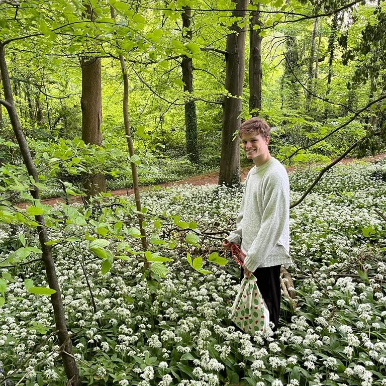

# Introduction

Welcome to group 22. Our final idea is *Doodle Jump*.

## Homework
- [v] [Paper prototype video](./static/IMG_0837.MOV)
- [v] [Class diagram](./static/DoodleJump_class_diagram.png)
- [v] [Egg with face](./EggWithFace.pde)
- [v] Doodle Jump foundation code ([DoodleJumpInit](./DoodleJumpInit/))
  
## For Development
1. Create branch and start develop.
```
git checkout -b <branch_name>
```

1. check you are on your own branch
```
git branch
```

1. commit you change
```
git add .
git commit -m <message>
```

1. push the commit on the branch
```
git push -u origin <branch_name>
```


# Team Members


- Joyee Tan

<!--  -->


- Shannon Lin

<!--  -->


- Zefeng Zhuang

- Henry Brooking

