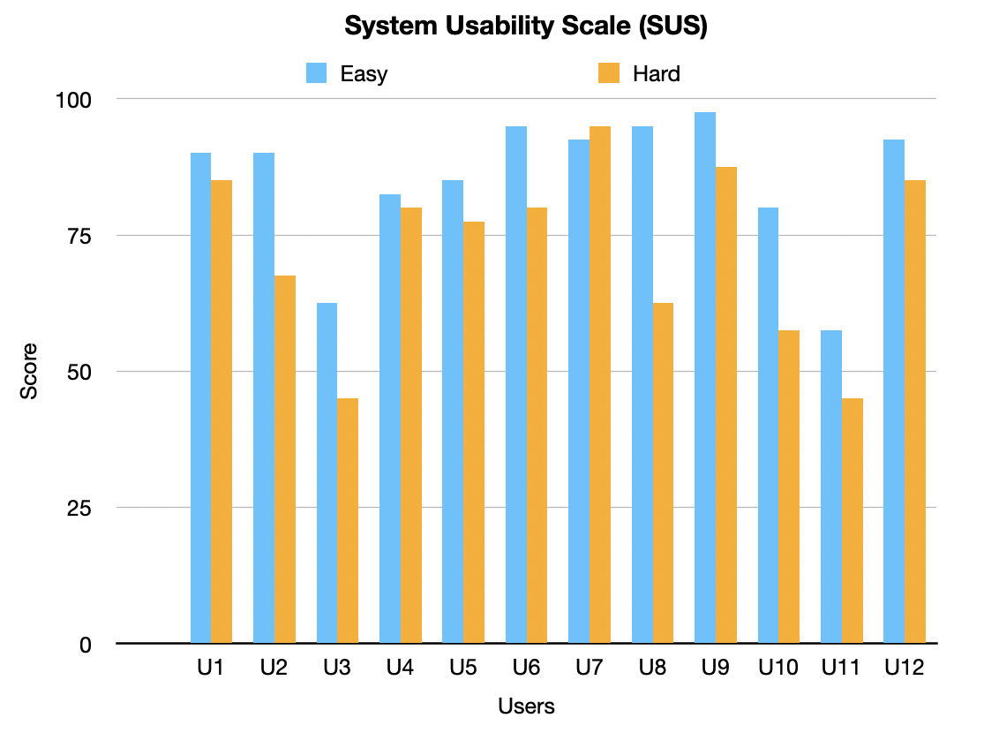

## Table of Contents
- [Team](#team)
- [Introduction](#introduction)
- [Requirements](#requirements)
  - [Ideation Process](#ideation-process)
  - [Early Stages Design](#early-stages-design)
- [Design](#design)
  - [System Architecture](#system-architecture)
  - [Class Diagram](#class-diagram)
  - [Sequence Diagram](#sequence-diagram)
- [Implementation](#implementation)
  - [Challenge 1: Platforming Framework](#challenge-1-platforming-framework)
  - [Challenge 2: Two-Player Mode](#challenge-2-two-player-mode)
  - [Challenge 3: Integration and UI](#challenge-3-integration-and-ui)
- [Evaluation](#evaluation)
    - [Qualitative Evaluations](#qualitative-evaluations)
    - [Quantitative Evaluations](#quantitative-evaluations)
    - [How code was tested](#how-code-was-tested)
- [Process](#process)
- [Conclusion](#conclusion)
  
# Team

<figure>
  
  <figcaption>Team Photo</figcaption>
</figure>

# Introduction

Our primary goal during the planning phase of our video game brief was to capture a modern, recognizable brand that was flexible and approachable to every kind of user while adhering to specific constraints derived from user stories. As a result, early discussions shifted away from more traditional forms of arcade gaming such as Pac-Man or Space Invaders.Instead, group ideas that were shortlisted sought to capture the instantly identifiable nostalgia of games that we, as video game players ourselves, grew up with, and which also met the requirements outlined in the ideation process.

Our game finally coalesced into a platforming video game, providing a twist on the original iPhone game Doodle Jump. The platforming aspect of Doodle Jump provided the perfect combination of simple, easy-to-pick-up game mechanics as well as the ability to implement a diverse range of gameplay twists. In our game you control your ‘doodle’, a customizable player character whose main objective is to steadily climb higher through a randomly generated environment. While doing so, players will encounter several obstacles whose goal is to slow down or defeat the player. These obstacles include different types of platforms such as ghost ledges, which cause the player to fall straight through, or single-use platforms that disappear when stepped on. Obstacles also include active enemies who spawn at varying intervals throughout the map, attempting to end the current user’s game. At the player’s disposal are several powerful abilities or ‘equipment’ that encourage fast-moving platforming, such as spring mechanisms and jetpack boosts. What distinguishes our game from other implementations of platforming games and Doodle Jump itself is the introduction of core game-play twists. These include:

1.	dynamic map manipulation by players that allows for exciting in-game problem solving

<figure>
  
  <figcaption>Demonstration of dynamic map manipulation</figcaption>
</figure>
 
 

2.	gravity inversion that shifts gameplay away from traditional platforming and towards a race-against-the-clock style

<figure>
  
  <figcaption>Demonstration of gravity inversion</figcaption>
</figure>
 
 

3.	a competitive two-player version that pits users against each other in an ‘elimination-style’ twist on the Doodle Jump formula

<figure>
  
  <figcaption>Demonstration of competitive two-player mode</figcaption>
</figure>
 
 

# Requirements

## Ideation Process
During the ideation process, our team focused on brainstorming potential game ideas that met specific constraints to ensure that the game we create was feasible to develop, has a good user appeal, and adheres to specific constraints.

To better understand what users may be interested in, we started by creating user stories. 

>"As young student, I want a game that is easy to undestand and yet challenging to play during my break time."

>"As a working professional, I want a game doesn't require internet connection, playable with one hand, quick, fun, and engaging game to play during commute."

To adhere to these constraints, we generated five game ideas, including chess, checkers, flappy bird, temple run, and doodle jump. We then evaluated these ideas based on their features, technical feasibility, and potential appeal to users.

We considered several features during our evaluation process, including whether the game was static or dynamic and whether it relied on strategy or reflexes. After careful consideration and by creating more user stories, 

>"As a single player, I want to be able to enjoy a game without relying on oher players."

>"As a player, I want a game that are challenging and require different levels of skill and strategy to master."

we eliminated the two static game ideas and opted for a dynamic and reflex-based game that we believed would be more appealing to users.

Next, we evaluated the remaining game ideas' technical feasibility and concluded that Doodle Jump was the most feasible game to develop. This was because the game has simple mechanics where the player only needs to jump from one platform to another, which does not require complex physics simulations or pathfinding algorithms like Temple Run or Flappy Bird. Doodle Jump also has a minimalist art style that doesn’t require detailed graphics or animations, which makes it easier for developers to create the necessary assets for the game. The game also only scrolls vertically, reducing the technical complexity of implementing scrolling.

After deciding on Doodle Jump as our final game, we brainstormed possible twists to make the game more thrilling. Ultimately, we settled on three ideas: Dynamic Map Manipulation also as known as Helping/SOS Platform, Gravity Inversion, and Two-Player PK Mode.

## Early Stages Design

Once we decided on creating a game based on Doodle Jump with three twists, we began the early stages of design. Our first step was to identify the core game mechanics and functionality needed for the game. We conducted research with paying particular attention to games with similar mechanics to Doodle Jump. This research helped us to identify the key game mechanics we needed to incorporate, such as jumping and avoiding obstacles.

Next, we developed a use case diagram to help us visualize the core use cases and actors involved in the game. This diagram helped us to identify the primary use cases and actors, and how they interacted with one another. We included the use cases for the basic version of Doodle Jump, as well as the three twists we planned to add. We also identified the actors involved in the game, including the player, broken platforms and monsters.
<figure>
  
  <figcaption>Base Game Use Case Diagram</figcaption>
</figure>

<figure>
  
  <figcaption>Use Case Diagram with Twist</figcaption>
</figure>
 
 
After developing the use case diagram, we created a paper prototype of the game.

<figure>
  
  <figcaption>Paper Prototype</figcaption>
</figure>
 
 
This prototype helped us to refine our design ideas and potential game mechanics. We experimented with different layouts, color schemes, and gameplay options to see what worked best. We also discussed and identified any potential issues or improvements. Through this process, we were able to make the necessary adjustments and refine our game design.

One of the key challenges we faced during the early stages of design was balancing the difficulty level of the game. We wanted the game to be challenging enough to keep players engaged, but not so difficult that it would frustrate them. We experimented with different platforms, monsters, and gameplay mechanics to find the right balance.

Overall, the early stages of design were crucial in helping us polish our game concept and identify the key features and functionality required for our game. By developing a use case diagram and a paper prototype, we were able to visualize the necessary game mechanics and implement our design ideas. This process helped us to create a solid foundation for the development of our game.

# Design

## System Architecture
The game’s architecture consists of three main components: the Game Manager, User Interface, and the Game Elements. These components work together to create a cohesive and engaging gaming experience.

<strong>Game Manager</strong>
 
Our "main" file acts as a Game Manager. The Game Manager is responsible for managing the overall game flow, including updating the game state, generating new game elements, and handling user input. It plays a crucial role in ensuring that the game runs smoothly and responds to user actions in a timely and appropriate manner.

For user input, we decided to use the left and right arrow keys as the main moving keys, as they are more intuitive than other options. Additionally, the 'z' key can be used to spawn a helping platform under the Doodler, and the 'space' key can be used to restart the game when it's game over. These user inputs are carefully chosen to provide a seamless and enjoyable gaming experience.

<strong>User Interface</strong>
 
We have five classes as our user interface components: start page, setting window, help window, pause window, and end page. The User Interface is designed to be easy to use and visually appealing, providing a seamless and enjoyable gaming experience for the user.

While acting as game manager, the "main" also plays a role in rendering the main game screen, which displays the player's score, as well as buttons for pausing the game. The start page consists of a help window button and a setting window button at the left and right top corner, respectively. It displays the game's title, choices of character, and a start button. The help window provides instructions for users to understand the game, while users can choose the difficulty level and switch to 2-player mode in the setting window. In the end page, the final score is shown in single player mode, whereas in two-player mode, the winner is shown.

<strong>Game Elements</strong>
 
The Game Elements component includes all of the game objects, such as Doodler, monsters, and platforms. Each of these game elements is implemented as a separate class, with its own set of properties and methods. These elements are carefully designed to be visually appealing and challenging, providing a fun and engaging gaming experience for the user.

The Doodler is the main character of the game, and is designed to be easy to control and visually appealing. The monsters and platforms provide a challenging obstacle for the Doodler to overcome, adding an element of excitement and difficulty to the game.

## Class Diagram

<figure>
  
  <figcaption>Class Diagram</figcaption>
</figure>
 
 
To create a clear and organized system for Doodle Jump, we've designed a class diagram that includes different pages and windows as classes to help players navigate and understand the game.

First, we have the Start Page class, which players see when they open the game. This class allows players to choose their character and provides access to two auxiliary windows: the Setting Window and the Help Window. The Setting Window allows players to adjust the number of players and the difficulty level, while the Help Window provides guidance on how to play the game. These pages are designed to enhance user control and freedom.

During gameplay, there are four important classes: Doodle, Platform, Equipment, and Monster. The objective is to help the Doodle jump as high as possible, while avoiding falling off the screen or colliding with monsters. Equipments can help the Doodle jump higher and gain points more efficiently, but can also lead to collisions with monsters. To implement these features, we've designed three interactions: Doodle & Platform, Doodle & Equipment, and Doodle & Monster.

When the Doodle touches a platform, it can jump to a specific level. When it touches equipment, it can jump higher, but must avoid colliding with monsters. In addition, three twists have been incorporated to change the gameplay slightly. The first twist is the Two-Player Mode, where players try to jump higher than each other, while avoiding monsters. The second twist is the Gravity Reverse Mode, where the objective is to move down the stairs without jumping on platforms, while avoiding spikes on the ceiling. Finally, the Helping Platform Mechanism allows players to generate a platform just below the Doodle under specific conditions, to save it from falling off the screen.

Lastly, the End Page class appears only when the game is over. Here, players can choose to start a new game or exit the game. Additionally, a Pause Window will appear if the player pauses the game, informing them of their paused status. By organizing the game into different windows and pages, we've created a clear and intuitive system for players to navigate and understand Doodle Jump.

## Sequence Diagram

<figure>
  
  <figcaption>Sequence Diagram</figcaption>
</figure>
 
 
Above is the sequence diagram for our game. The sequence diagram shows the interactions between the different components of the game, including the player, the platforms, the monsters, and the score system. First of all, the game generates various types of platforms randomly, including normal, fragile, broken, spring, and rocket platforms. Each platform provides different feedback to the doodler based on its characteristics.

When the player moves the doodler to the left or right, the doodler can land on a platform, and the platform will provide feedback to the doodler. The normal platform and fragile platform both return the "jump" feedback, but the fragile platform will disappear at the same time. On the other hand, the broken platform will not provide any feedback but disappear when the doodler interacts with it. The spring platform and rocket platform provide different types of jumps. The spring platform helps the doodler to jump higher, while the rocket reduces gravity, allowing the doodler to fly.
In addition to the different types of platforms, there are also empty areas where there are no platforms for the doodler to land on. When this happens, the game constantly checks whether the doodler is out of the window. If the doodler is out of the window, the game is over. Furthermore, monsters will appear at random times, intervals, and places. If the doodler touches a monster, the game is also over.

If the player is good enough to reach a certain score, a gravity reverse is triggered, causing the player to go downwards instead of jumping to avoid touching the ceiling spike. If the doodler touches the ceiling spike, the game is over.

# Implementation

## Challenge 1: Platforming Framework
Implementing the early platforming logic of the player character and the surrounding objects proved to be relatively straightforward in their design.  Writing our game in Processing allowed us to straightforwardly generate player characters, manipulate their velocity, and implement simple collision detection between the user and the surrounding platform. The first challenge that emerged in our game implementation was designing the nature of our randomly generated map, in particular, cycling through successfully navigated parts of the map. 

One problem that seemed to emerge among other project groups was the difficulty in translating the map and its obstacles to the movement of the user. Our game structure navigated these problems by ensuring that the platform entities (and in turn the equipment and monster entities) were all instantiated within the Doodler class. This allowed us to manipulate these objects in a way that responded to the current configuration of the player character. This also presented a novel solution to a secondary problem that immediately impacted platforming performance and memory allocation. When the map failed to adequately react to the movement of the player the large number of platform, equipment, and monster entities being spawned caused map generation errors, hardware lag, and eventual crashing. By successfully implementing a reactive map generation process, our software was able to identify when parts of the map had been successfully traversed and were therefore being rendered off-screen. In doing so we were able to purge navigated entities that no longer needed to be rendered ensuring a smooth, efficient game execution.

## Challenge 2: Two-Player Mode
Having implemented a basic platforming method that represented the underlying framework for the rest of our software, the next development challenge was the incorporation of the gameplay twist elements. Developing our two-player game mode presented several challenges, particularly in its integration with the base game model.

The two-player method required tweaking how user inputs were registered, allowing for multiple key presses and directional changes among the two users. Creating this alternate game state for two players also required a careful rebalancing of equipment objects. Preliminary feedback recognised that powerful changes to a doodle’s velocity and map position, which caused games to end prematurely, threatened the fairness and enjoyment of the game mode. As a result, alterations were made to interactions with equipment to lessen their impact and the method behind map generation was altered slightly to favour whichever doodle was traversing fastest.

## Challenge 3: Integration and UI
In addition to the two-player mode, we aimed to develop and refine two other gameplay twists: reversed gravity mode and user-controlled map layout. The final challenge involved integrating these separate components into a cohesive product. It was crucial to develop a clean and readable codebase for developers while ensuring an intuitive user interface for players. Another consideration was structuring the game difficulty to account for the impact of gameplay twists and map enemies on the overall challenge.

To address these concerns, we designed a layered interface that enabled users to select between single and multiplayer modes and adjust map difficulty. Each incremental difficulty level would introduce a new, more challenging gameplay twist. This approach allowed us to communicate gameplay twists effectively and provide players with the flexibility to customize their experience according to their preferences and skill level.

<figure>
  
  <figcaption>Level Difficulty Selection and One-Player and Two-Player Modes </figcaption>
</figure>
 
 

Furthermore, we invested considerable time in refining the visual design and layout of our user interface. This process involved crafting clear and concise menus, easily identifiable buttons and icons, as well as a visually appealing color scheme and distinct platform patterns that remained consistent throughout the game. We developed two UI designs and held a vote, taking into consideration our primary goal: ensuring that players could quickly understand and navigate the various options and settings available to them, without feeling overwhelmed or confused. By selecting the most user-friendly design, we prioritized creating an enjoyable and seamless gaming experience for our players.

  <figure>
    
    <figcaption>Design1</figcaption>
  </figure>
  <figure>
    
    <figcaption>Design2</figcaption>
  </figure>

 
<!-- add vote result -->

# Evaluation
Our team conducted a comprehensive evaluation process, incorporating both qualitative and quantitative evaluations, to assess and improve our game's usability and performance throughout its development. Instead of performing one qualitative and one quantitative evaluation, as per the original requirement, we decided to conduct two of each to gain more practical experience and in-depth understanding.

### Qualitative Evaluations

We conducted Think Aloud Evaluations and Heuristic evaluations at three stages throughout the development process.

<strong>Stage 1</strong>:

At this stage, we had our base game with a start page for choosing characters and a game over page. We set up two tasks for users to perform:

1. Choose a character.
2. Play the game until reaching a score of 100. 

From the Think Aloud Evaluations, we identified the following issues:

- Users were unsure how to choose a character, so we added a dialog with instructions.
- Users found the game too easy, prompting us to add three difficulty levels.
- Users struggled at the start of the game, so we added a platform under the doodler to provide enough time for users to react.

The Heuristic Evaluation highlighted that the game violated the heuristic "Help and documentation," so we added a help page for detailed instructions.

<strong>Stage 2</strong>:

At this stage, we added different difficulty levels, twists, and made modifications based on the feedback from the first stage. We set up six different tasks related to the game, which are:
1. Access the help page.
2. Adjust the difficulty level.
3. Achieve score of 150.
4. Pause the game.
5. Return to the home page after the game is over.
6. Engage in a two-player competition.

Based on the Think Aloud Evaluations, we addressed the following issues:
- Continuous broken platforms causing the game to get stuck. We fixed this by avoiding the occurrence of two continuous platforms.
- Gravity reverse platform inconsistency, which confused users. We changed to one color when in gravity reverse mode.
- Help page exit button and setting page save button incompatible with Windows Operating System. We resolved this by changing to an image instead of using the special character.
- Setting window lacked an exit button, so we added one to improve consistency.
- Users often ignored the function of the spacebar to restart the game, so we capitalized the 'SPACE' word to highlight the function.
- In two-player mode, users did not know who had won the game. We added the image of the sprite to make it clearer.
- The instructions on the help page were not clear enough, so we made modifications based on user feedback.

The Heuristic Evaluation in Stage 2 revealed the following issues:

- The game still violated the heuristic "Help and documentation" as it lacked a description of the spring and jetpack features. We added these instructions to the help page.
- An issue related to "Consistency and standards" was identified due to the non-standard save button on the settings page. We resolved this issue along with the compatibility issues mentioned above.
- The lack of an exit button in the settings page violated the heuristic "User control and freedom."
- An issue related to "Flexibility and efficiency of use" was raised, suggesting a key on the keyboard to function as a pause button. We added the 'space' bar to serve this purpose.

<strong>Stage 3</strong>:

The tasks at this stage were the same as the second stage. The Think Aloud Evaluations revealed the following issues:

1. In 2 player mode, users were unsure who was playing as Player 1 and Player 2.
2. In 2 player mode, users wanted to add a feature like gravity reverse.
3. In 1 player mode, users wanted to know their previous score.

The Heuristic Evaluation at this stage only revealed one issue related to the heuristic "Recognition rather than recall" since we did not have any prompt showing which sprite was Player 1 and which was Player 2. 

Due to time constraints, we were unable to resolve all the issues identified in this stage, but we determined that these features were worth considering for future updates.

###  Quantitative Evaluations

In our quantitative evaluation, we utilized the System Usability Scale (SUS) and the NASA Task Load Index (TLX) to assess the workload and usability of different levels of difficulty in our game. To efficiently gather feedback, we created <a href="https://docs.google.com/forms/d/1n--beeDPrN-xyo5WdQrB-BVJeVDlw9u0uaZuQQKLqfs/edit?sharingaction=ownershiptransfer&ts=6442a99c">Google Forms</a> and distributed them online, successfully collecting data from 12 respondents.

We conducted a Wilcoxon signed-rank test and discovered a significant difference between the scores of the "easy" and "hard" levels. The SUS yielded a W-value of 1.5, while the NASA TLX produced a W-value of 0. The individual scores for each question in the TLX test were 1.5, 2, 0, 0, 1.5, and 0. The most pronounced difference between the two difficulty levels was found in physical demand, followed by mental demand and effort. The raw data for the NASA and SUS can be found at the following link: <a href="static/evaluations/quantitative_evaluation">static/evaluations/quantitative_evaluation</a>.

<!-- raw data -->

<!-- <strong> System Usability Scale (SUS) </strong> -->

  <figure>
    
  </figure>
 

  <figure>
    
  </figure>
 

<!-- | Participant | **Easy** | **Hard** |
| ----------- | -------- | -------- |
| 1           | 90       | 85       |
| 2           | 90       | 67.5     |
| 3           | 62.5     | 45       |
| 4           | 82.5     | 80       |
| 5           | 85       | 77.5     |
| 6           | 95       | 80       |
| 7           | 92.5     | 95       |
| 8           | 95       | 62.5     |
| 9           | 97.5     | 87.5     |
| 10          | 80       | 57.5     |
| 11          | 57.5     | 45       |
| 12          | 92.5     | 85       | -->

<!-- <strong> NASA Task Load Index (TLX) </strong>

| Participant | **Easy**     | **Hard**         |
|-------------|--------------|--------------|
| 1           | 30       | 60       |
| 2           | 45       | 55       |
| 3           | 36.67    | 73.33    |
| 4           | 30       | 53.33    |
| 5           | 15       | 43.33    |
| 6           | 26.67    | 70       |
| 7           | 13.33    | 40       |
| 8           | 20       | 43.33    |
| 9           | 26.67    | 56.67    |
| 10          | 43.33    | 55       |
| 11          | 48.33    | 51.67    |
| 12          | 18.33    | 71.67    | -->

### How code was tested

In developing our Doodle Jump game, we thoroughly tested the code by modifying functions within the code to output relevant information when the mouse cursor interacted with specific locations in the game. This information was logged in a file, allowing us to analyze the log file and identify valid and invalid operations.

The game consists of three main screens: the start screen, the game screen, and the end screen. Each of these screens has various areas that require testing. On the start screen, we focused on five key areas: the help button in the top-left corner, the settings button in the top-right corner, and the three character selection buttons in the center. In the game screen, we considered the two gameplay modes—normal mode and gravity reverse mode,each with its specific constraints on the Doodle character's position. We also tested the placement of the SOS/helping platform, which should appear at a fixed position below the character. Additionally, we examined the pause button's location in the top-right corner to ensure it was easily accessible for the player during critical moments. Finally, on the end screen, we tested the go home button's position requirements.

Our primary testing method was equivalence partitioning, a technique that divides input data into equivalent partitions, where each partition represents a range of input values that should produce the same output. This method enables efficient testing by identifying representative test cases for each partition, reducing the number of test cases required while maintaining test coverage.

For example, in our start page testing, we created the following table to summarize the valid and invalid conditions for the x and y coordinates of the key areas:

<strong> Start page </strong>

| **Category**                  |       | **Condition**      |
| ----------------------------- | ----- | ------------------ |
| valid help button x           | HX_1  | 25 ≤ x ≤ 65        |
| invalid help button x         | HX_2  | x < 25 or x > 65   |
| valid help button y           | HY_1  | 25 ≤ y ≤ 65        |
| invalid help button y         | HY_2  | y < 25 or y > 65   |
| valid setting button x        | SX_1  | 340 ≤ x ≤ 365      |
| invalid setting button x      | SX_2  | x < 340 or x > 365 |
| valid setting button y        | SY_1  | 25 ≤ y ≤ 65         |
| invalid setting button y      | SY_2  | y < 25 or y > 65    |
| valid character selection y   | CSY_1 | 400 ≤ y ≤ 505      |
| invalid character selection y | CSY_2 | y < 400 or y > 505 |
| valid left character x        | LCX_1 | 17 ≤ x ≤ 141       |
| invalid left character x      | LCX_2 | x < 17 or x > 141  |
| valid middle character x      | MCX_1 | 142 ≤ x ≤ 232      |
| invalid middle character x    | MCX_2 | x < 142 or x > 232 |
| valid right character x       | RCX_1 | 233 ≤ x ≤ 400      |
| invalid right character x     | RCX_2 | x < 233 or x > 400 |

<strong> Gameplay </strong>

| **Category**                     |       | **Condition**        |
| -------------------------------- | ----- | -------------------- |
| valid doodle x (normal mode)     | DX_1  | 0 ≤ x ≤ 400          |
| valid doodle y (normal mode)     | DY_1  | y ≥ 0                |
| valid doodle x (Downstairs mode) | DX_2  | 0 ≤ x ≤ 400          |
| valid doodle y (Downstairs mode) | DY_2  | y ≤ 0                |
| invalid doodle x                 | DX_3  | x < 0 or x > 400     |
| valid sos brick x                | SBX_1 | x = doodle's x value |
| valid sos brick y                | SBY_1 | y ≤ doodle's y value |
| invalid sos brick x              | SBX_2 | x ≠ doodle's x value |
| invalid sos brick y              | SBY_2 | y > doodle's y value |
| valid ordinary brick x           | OBX_1 | 0 ≤ x ≤ 400          |
| valid ordinary brick y           | OBY_1 | y ≥ 300         |
| invalid ordinary brick x         | OBX_2 | x < 0 or x > 400     |
| invalid ordinary brick y         | OBY_2 | y < 300     |
| valid pause button x             | SX_1  | 340 ≤ x ≤ 370        |
| invalid pause button x           | SX_2  | x < 340 or x > 370   |
| valid pause button y             | SY_1  | 20 ≤ y ≤ 50          |
| invalid pause button y           | SY_2  | y < 20 or y > 50     |

<strong> Pause Window </strong>

| **Category**                     |       | **Condition**        |
| -------------------------------- | ----- | -------------------- |
| valid continue button x             | CBX_1  | doodle's x-80 ≤ x ≤ doodle's x+80        |
| invalid continue button x           | CBX_2  | x < doodle's x-80 or x > doodle's x+80   |
| valid continue button y             | CBY_1  | doodle's y+30 ≤ y ≤ doodle's y+80          |
| invalid continue button y           | CBY_2  | y < doodle's y+30 or y > doodle's y+80      |
| valid exit button x                 | EX_1  | doodle's x-80 ≤ x ≤ doodle's x+80       |
| invalid exit button x               | EX_2  | x < doodle's x-80 or x > doodle's x+80   |
| valid exit button y                 | EY_1  | y < doodle's y+80 or y > doodle's y+160         |
| invalid exit button y               | EY_2  | y < doodle's y+80 or y > doodle's y+160      |

<strong> end page </strong>

| **Category**                        |       | **Condition**      |
| ----------------------------------- | ----- | ------------------ |
| valid end interface home button x   | EHX_1 | 144 ≤ x ≤ 259      |
| invalid end interface home button x | EHX_2 | x < 144 or x > 259 |
| valid end interface home button y   | EHY_1 | 282 ≤ y ≤ 327      |
| invalid end interface home button y | EHY_2 | y < 282 or y > 327 |

By using equivalence partitioning testing in combination with other testing techniques, we ensured that our game functioned as intended, providing a smooth and enjoyable experience for the players.

# Process
In developing our game, our goal was not only to create an enjoyable and engaging experience for players but also to thoroughly understand and apply the principles of good software engineering. To achieve this, our team embraced the Agile methodology and integrated its key principles into our workflow.

Our team consisted of five members: Joyee, Shannon, Henry, Yu, and Luis. Each member took on specific roles and responsibilities to ensure a well-structured and efficient workflow:

1. Joyee: Main project manager and lead     developer, overseeing the overall progress, integrating the work of other developers, and merging the code when a team member moved a task to "To merge" on the Trello board.
2. Shannon: Vice project manager and main developer, collaborating with Joyee in project management, sharing decision-making responsibilities, and contributing to development.
3. Henry: Main developer and sprite designer, responsible for implementing game features and creating visual assets.
4. Yu: Developer and tester, handling a smaller part of development and ensuring the quality of the final product.
5. Luis: Game style and evaluation lead, focusing on the game's aesthetics, user experience, and performance assessment.

Our Agile approach involved dividing the project into three life cycles, each representing a phase or a major milestone. Within each life cycle, we organized multiple sprints to iteratively develop features, fix bugs, and make improvements. For each sprint, we utilized planning poker during sprint planning meetings to estimate the effort required for the tasks in the upcoming sprint. This approach helped us maintain adaptability, respond to changes quickly, and foster a continuous improvement mindset.

 
<figure>
  
  <figcaption>Trello interface</figcaption>
</figure>
 
 

During the project, we encountered situations where some team members did not manage to complete their assigned story points within a sprint. To address this issue, we adjusted our sprint planning and updated the burn chart to reflect the changes. This allowed us to maintain a realistic project timeline and allocate resources effectively, ensuring that the team could continue to make progress.

<!-- burn chart -->

We used Trello as our Kanban board to visualize and manage tasks, allowing us to monitor progress and make adjustments as needed. By incorporating planning poker in each sprint, we ensured a shared understanding of task complexity among team members, encouraged them to voice their opinions, and facilitated communication and collaboration.

 
<figure>
  
  <figcaption>Planning Poker interface</figcaption>
</figure>
 
 

After completing the planning poker, we assigned story points to each task according to the team member's capacity and the previous burn chart. This allowed us to balance the workload effectively and ensure that each team member was allocated tasks that matched their skills and availability. This practice also helped us monitor the team's progress and make adjustments as needed to stay on track.

Although we did not hold daily stand-up meetings, our team stayed in constant communication through social media platforms like WhatsApp and Microsoft Teams. This allowed us to discuss any obstacles encountered, seek support from the team, and share updates on our progress. Our consistent communication ensured that everyone was aligned with the project goals and fostered a collaborative environment.

To further facilitate collaboration and maintain an Agile mindset, we utilized pair programming sessions which involved two developers working together on the same code. For instance, the reverse gravity feature was developed jointly by Joyee and Shannon, with Joyee taking on the role of the helm while Shannon acted as the tactician. This practice not only improved the quality of our code but also allowed us to share knowledge and learn from each other.

Throughout the project, we implemented regular feedback loops by conducting evaluations at each stage of the life cycles. This enabled us to continuously assess our game's quality and make necessary improvements based on user feedback and performance metrics. Our Agile approach emphasized the importance of incorporating user feedback, allowing us to create a game that is engaging and enjoyable for players.

As a result of our Agile process, which included organizing our work into three life cycles with multiple sprints and utilizing planning poker in each sprint, our team was able to effectively manage tasks, address challenges, and adapt to changes. This, in turn, led to the successful development of our game while maintaining a strong focus on good software engineering practices.

To sum up, our team's commitment to the Agile methodology, including planning poker and story point allocation, played a crucial role in the successful completion of our project. We learned the value of iterative development, continuous improvement, and open communication in managing a complex software development process. These lessons have not only contributed to our game's quality but have also shaped our understanding of effective software engineering practices, which will undoubtedly benefit us in future projects.

# Conclusion
In conclusion, the development of our Doodle Jump-inspired game presented numerous challenges and learning opportunities. Our project encompassed the creation of a comprehensive system architecture, incorporating various components such as the Game Manager, User Interface, and Game Elements. These components worked together to provide an engaging and seamless gaming experience.

Throughout the development process, we focused on building a well-structured codebase. The use of system architecture, class diagrams, and sequence diagrams played a crucial role in achieving this goal. They offered clear organization and nurtured communication among team members, ensuring everyone shared a common understanding of the code's structure and interactions. This approach facilitated better planning, design, easier debugging, and improved scalability and maintainability.

Adopting an Agile development approach enabled us to iteratively refine our game mechanics, user interface, and overall user experience. The Agile methodology allowed us to be flexible and responsive to feedback gathered from users, leading to continuous improvement throughout the project. We conducted evaluations and gathered user feedback, which played a critical role in guiding our development decisions and ensuring the game met the desired quality standards. This iterative evaluation process allowed us to identify and address potential issues early on, contributing to a more polished and enjoyable gaming experience.

We encountered various challenges during development, including refining the gameplay experience and ensuring a smooth integration of multiple gameplay twists. To address these challenges, we developed creative solutions, such as adjusting equipment interactions for fairness in the two-player mode and creating a layered user interface that allowed for easy customization of game settings.

This project provided valuable lessons in teamwork, project management, and game development. We learned the importance of clear communication and organization, as well as the value of incorporating user feedback into our design process. Our experience adopting Agile development practices also highlighted the advantages of iterative development and continuous improvement.

Despite our progress, there is potential for further improvements and expansion. The game could benefit from enhanced visual and audio design, providing a more immersive experience for players. We could also explore the implementation of additional gameplay twists, mechanics, and challenges to keep the game fresh and engaging. Further user testing and feedback will be invaluable in refining the game and ensuring its appeal to players of all skill levels. Additionally, we could explore integrating online multiplayer functionality, allowing players to compete against each other from different locations.

Overall, our Doodle Jump-inspired game project was a rewarding experience that taught us valuable skills and insights into software engineering, particularly in the context of game development. The challenges we faced and the lessons learned in the process have broadened our understanding of effective software design, project management, and teamwork. By reflecting on these experiences, we are better equipped to tackle future projects and create software solutions that are efficient, scalable, and maintainable.

Applying the principles of software engineering to game development has demonstrated the importance of planning, organization, and communication in achieving a successful project outcome. As we continue to grow as software engineers, we will carry forward the lessons learned from this project, incorporating user feedback, adopting Agile development practices, and focusing on creating well-structured codebases. These experiences will enable us to deliver high-quality software products that not only meet the needs of users but also stand the test of time.

<!-- ### [Class Diagram](https://app.diagrams.net/#G1eO5WRYrhPcYVJps2LNeKAyVoR5l_IiGF)
 -->

<!-- # Team Members

- Joyee Tan

- Shannon Lin

- Zefeng Zhuang

- Henry Brooking

- Yu Tian -->
