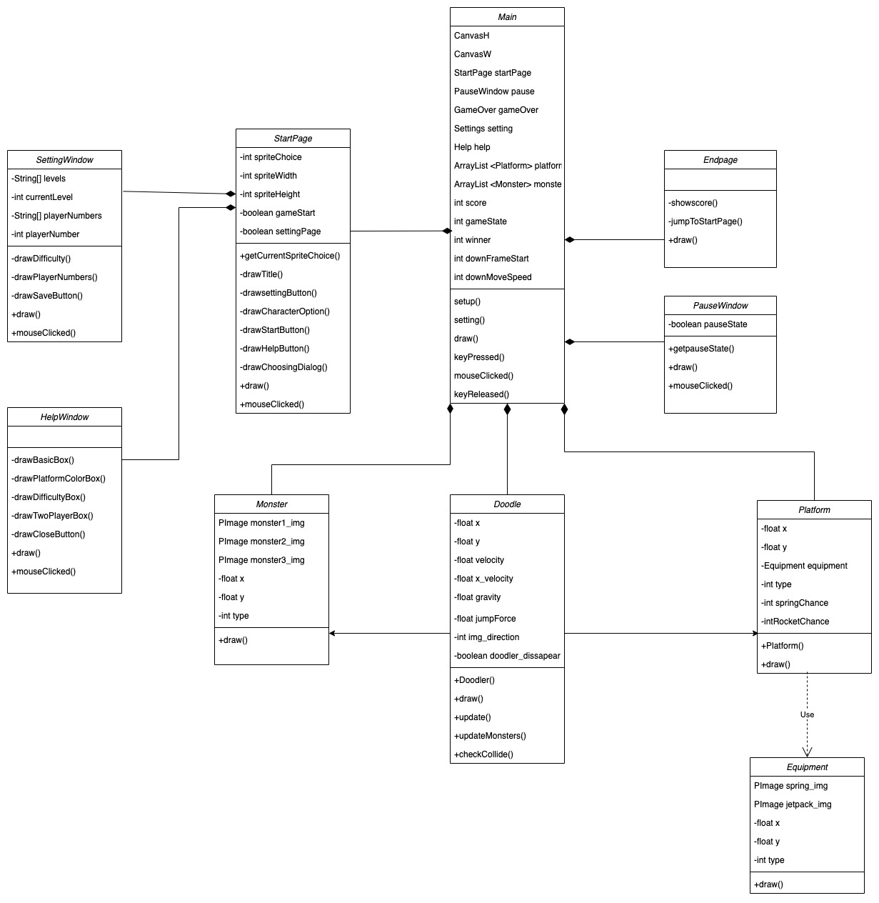

# Introduction

Welcome to group 22. Our final idea is *Doodle Jump*.

# Requirements

## Ideation process
During the ideation process, our team focused on brainstorming potential game ideas that met specific constraints to ensure that the game we create was feasible to develop, has a good user appeal, and adheres to specific constraints.

To better understand what users may be interested in, we started by creating user stories. 

"As young student, I want a game that is easy to undestand and yet challenging to play during my break time."

"As a working professional, I want a game doesn't require internet connection, playable with one hand, quick, fun, and engaging game to play during commute."

To adhere to these constraints, we generated five game ideas, including chess, checkers, flappy bird, temple run, and doodle jump. We then evaluated these ideas based on their features, technical feasibility, and potential appeal to users.

We considered several features during our evaluation process, including whether the game was static or dynamic and whether it relied on strategy or reflexes. After careful consideration and by creating more user stories, 

"As a single player, I want to be able to enjoy a game without relying on oher players."

"As a player, I want a game that are challenging and require different levels of skill and strategy to master."

we eliminated the two static game ideas and opted for a dynamic and reflex-based game as we believed they are more appealing to users.

Next, we evaluated the remaining game ideas' technical feasibility and concluded that Doodle Jump was the most feasible game to develop. This was because the game has simple mechanics where the player only needs to jump from one platform to another, which does not require complex physics simulations or pathfinding algorithms like Temple Run or Flappy Bird. Doodle Jump also has a minimalist art style that doesn’t require detailed graphics or animations, which makes it easier for developers to create the necessary assets for the game. The game also only scrolls vertically, reducing the technical complexity of implementing scrolling.

After deciding on Doodle Jump as our final game, we brainstormed possible twists to make the game more thrilling. Ultimately, we settled on three ideas: Helping Platform, Gravity Reverse, and Two-Player PK Mode.

## Early stages design

Once we decided on creating a game based on Doodle Jump with three twists, we began the early stages of design. Our first step was to identify the core game mechanics and functionality needed for the game. We conducted research with paying particular attention to games with similar mechanics to Doodle Jump. This research helped us to identify the key game mechanics we needed to incorporate, such as jumping and avoiding obstacles.

Next, we developed a use case diagram to help us visualize the core use cases and actors involved in the game. This diagram helped us to identify the primary use cases and actors, and how they interacted with one another. We included the use cases for the basic version of Doodle Jump, as well as the three twists we planned to add. We also identified the actors involved in the game, including the player, broken platforms and monsters.
<figure>
  
  <figcaption>Base Game Use Case Diagram</figcaption>
</figure>

<figure>
  
  <figcaption>Use Case Diagram with Twist</figcaption>
</figure>

After developing the use case diagram, we created a paper prototype of the game.

<figure>
  
  <figcaption>Paper Prototype</figcaption>
</figure>

This prototype helped us to refine our design ideas and iterate on the game mechanics. We experimented with different layouts, color schemes, and game mechanics to see what worked best. We also discuss and identify any potential issues or improvements. Through this process, we were able to make the necessary adjustments and refine our game design.

One of the key challenges we faced during the early stages of design was balancing the difficulty level of the game. We wanted the game to be challenging enough to keep players engaged, but not so difficult that it would frustrate them. We experimented with different platforms, monsters, and gameplay mechanics to find the right balance.

Overall, the early stages of design were crucial in helping us to refine our game concept and identify the key features and functionality required for our game. By developing a use case diagram and a paper prototype, we were able to visualize the game mechanics and iterate on our design ideas. This process helped us to create a solid foundation for the development of our game.

# Design

## System Architecture
The game’s architecture consists of three main components: the Game Manager, User Interface, and the Game Elements. These components work together to create a cohesive and engaging gaming experience.

<strong>Game Manager</strong>
 
Our "main" file acts as a Game Manager. The Game Manager is responsible for managing the overall game flow, including updating the game state, generating new game elements, and handling user input. It plays a crucial role in ensuring that the game runs smoothly and responds to user actions in a timely and appropriate manner.

For user input, we decided to use the left and right arrow keys as the main moving keys, as they are more intuitive than other options. Additionally, the 'z' key can be used to spawn a helping platform under the Doodler, and the 'space' key can be used to restart the game when it's game over. These user inputs are carefully chosen to provide a seamless and enjoyable gaming experience.

<strong>User Interface</strong>
 
We have five classes as our user interface components: start page, setting window, help window, pause window, and end page. The User Interface is designed to be easy to use and visually appealing, providing a seamless and enjoyable gaming experience for the user.

While acting as game manager, the "main" also plays a role in rendering the main game screen, which displays the player's score, as well as buttons for pausing the game. The start page consists of a help window button and a setting window button at the left and right top corner, respectively. It displays the game's title, choices of character, and a start button. The help window provides instructions for users to understand the game, while users can choose level difficulty and switch to 2-player mode in the setting window. In the end page, the final score is shown in single player mode, whereas in two-player mode, the winner is shown.

<strong>Game Elements</strong>
 
The Game Elements component includes all of the game objects, such as Doodler, monsters, and platforms. Each of these game elements is implemented as a separate class, with its own set of properties and methods. These elements are carefully designed to be visually appealing and challenging, providing a fun and engaging gaming experience for the user.

The Doodler is the main character of the game, and is designed to be easy to control and visually appealing. The monsters and platforms provide a challenging obstacle for the Doodler to overcome, adding an element of excitement and difficulty to the game.

## Class Diagram

<figure>
  
  <figcaption>Class Diagram</figcaption>
</figure>

To create a clear and organized system for Doodle Jump, we've designed a class diagram that includes different pages and windows as classes to help players navigate and understand the game.

First, we have the Start Page class, which players see when they open the game. This class allows players to choose their character and provides access to two auxiliary windows: the Setting Window and the Help Window. The Setting Window allows players to adjust the number of players and difficulty level, while the Help Window provides guidance on how to play the game. These pages are designed to enhance user control and freedom.

During gameplay, there are four important classes: Doodle, Platform, Equipment, and Monster. The objective is to help the Doodle jump as high as possible, while avoiding falling off the screen or colliding with monsters. Equipments can help the Doodle jump higher and gain points more efficiently, but can also lead to collisions with monsters. To implement these features, we've designed three interactions: Doodle & Platform, Doodle & Equipment, and Doodle & Monster.

When the Doodle touches a platform, it can jump to a specific level. When it touches equipment, it can jump higher, but must avoid colliding with monsters. In addition, three twists have been incorporated to change the gameplay slightly. The first twist is the Two-Player Mode, where players try to jump higher than each other, while avoiding monsters. The second twist is the Gravity Reverse Mode, where the objective is to move down the stairs without jumping on platforms, while avoiding spikes on the ceiling. Finally, the Helping Platform Mechanism allows players to generate a platform just below the Doodle under specific conditions, to save it from falling off the screen.

Lastly, the End Page class appears only when the game is over. Here, players can choose to start a new game or exit the game. Additionally, a Pause Window will appear if the player pauses the game, informing them of their paused status. By organizing the game into different windows and pages, we've created a clear and intuitive system for players to navigate and understand Doodle Jump.

## Sequence Diagram

<figure>
  
  <figcaption>Sequence Diagram</figcaption>
</figure>

Above is the sequence diagram for our game. The sequence diagram shows the interactions between the different components of the game, including the player, the platforms, the monsters, and the score system. First of all, the game generates various types of platforms randomly, including normal, fragile, broken, spring, and rocket platforms. Each platform provides different feedback to the doodler based on its characteristics.

When the player moves the doodler to the left or right, the doodler can land on a platform, and the platform will provide feedback to the doodler. The normal platform and fragile platform both return the "jump" feedback, but the fragile platform will disappear at the same time. On the other hand, the broken platform will not provide any feedback but disappear when the doodler interacts with it. The spring platform and rocket platform provide different types of jumps. The spring platform helps the doodler to jump higher, while the rocket reduces gravity, allowing the doodler to fly.
In addition to the different types of platforms, there are also empty areas where there are no platforms for the doodler to land on. When this happens, the game constantly checks whether the doodler is out of the window. If the doodler is out of the window, the game is over. Furthermore, monsters will appear at random times, intervals, and places. If the doodler touches a monster, the game is also over.

If the player is good enough to reach a certain score, a gravity reverse is triggered, causing the player to go down instead of jumping to avoid touching the ceiling spike. If the doodler touches the ceiling spike, the game is over.

<!-- ### [Class Diagram](https://app.diagrams.net/#G1eO5WRYrhPcYVJps2LNeKAyVoR5l_IiGF)
 -->

# Team Members

- Joyee Tan

<!--  -->

- Shannon Lin

<!--  -->

- Zefeng Zhuang

- Henry Brooking

