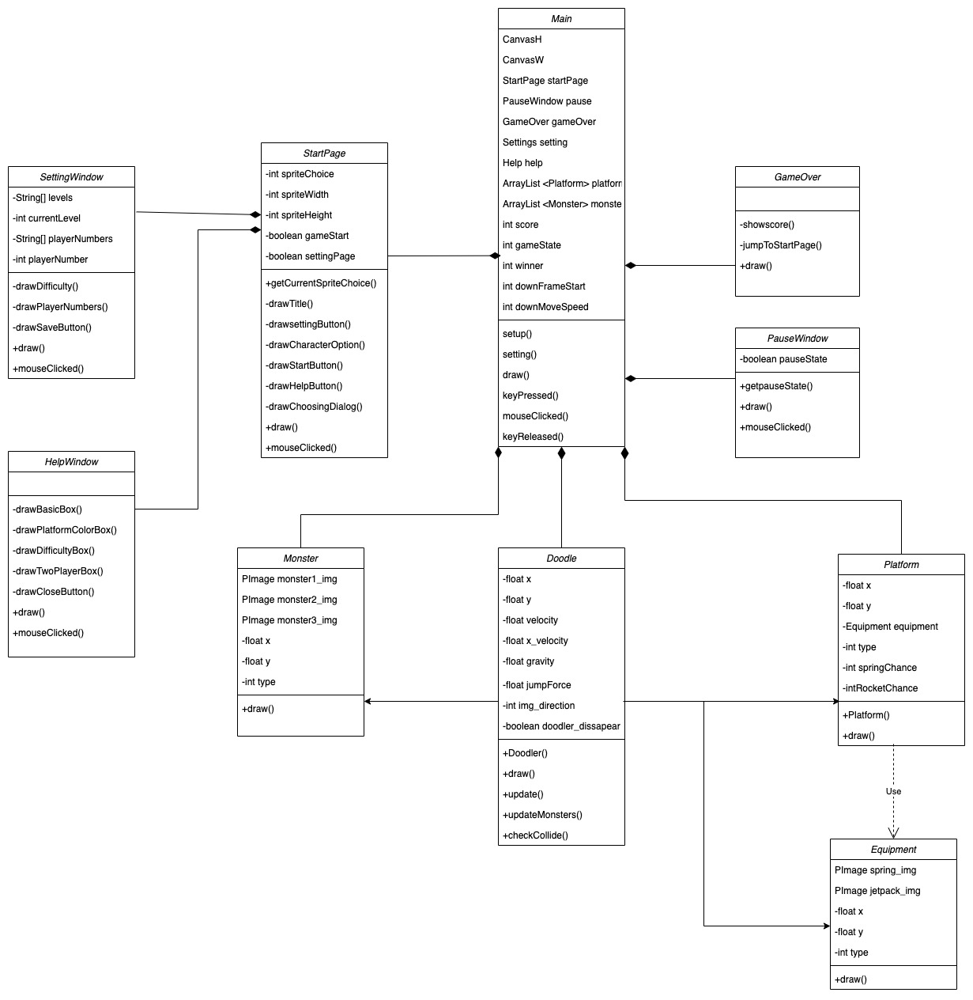

  

- [Design](#design)
  - [System Architecture](#system-architecture)
  - [Class Diagram](#class-diagram)
  - [Sequence Diagram](#sequence-diagram)

# Design

## System Architecture
The game’s architecture consists of three main components: the Game Manager, User Interface, and the Game Elements. These components work together to create a cohesive and engaging gaming experience.

<strong>Game Manager</strong>
 
Our "main" file acts as a Game Manager. The Game Manager is responsible for managing the overall game flow, including updating the game state, generating new game elements, and handling user input. It plays a crucial role in ensuring that the game runs smoothly and responds to user actions in a timely and appropriate manner.

For user input in single-player mode, we opted for the left and right arrow keys as the primary movement controls, as they are more intuitive than alternative options. In two-player mode, we chose the 'A' and 'D' keys for the second player's movement. This decision was made to maintain a comfortable hand position for both players, with the left hand controlling the first player using arrow keys, and the right hand controlling the second player using 'A' and 'D' keys. Additionally, the 'Z' key can be used to create a helping platform beneath the Doodler. The 'space' key serves two purposes: pausing the game during gameplay and restarting the game when it is over. These inputs were carefully selected to ensure a seamless and enjoyable gaming experience.

<strong>User Interface</strong>
 
We have five classes as our user interface components: start page, setting window, help window, pause window, and game over page. The User Interface is designed to be user-friendly and visually appealing, providing a seamless and enjoyable gaming experience for the user.

While acting as game manager, the "main" also plays a role in rendering the main game screen, which displays the player's score, as well as buttons for pausing the game. The start page consists of a help window button and a setting window button at the left and right top corner, respectively. It displays the game's title, choices of character, and a start button. The help window provides instructions for users to understand the game, while users can choose the difficulty level and switch to 2-player mode in the setting window. In the game over page, the final score is shown in single player mode, whereas in two-player mode, the winner is shown.

<strong>Game Elements</strong>
 
The Game Elements component includes all of the game objects, such as Doodler, monsters, and platforms. Each of these game elements is implemented as a separate class, with its own set of properties and methods. These elements have been meticulously designed to be visually engaging and challenging, ensuring a fun and captivating gaming experience.

The Doodler is the main character of the game, designed to be easy to control and visually appealing. The monsters pose a challenge for the Doodler to avoid, while the platforms offer various opportunities to jump higher, adding elements of excitement and difficulty to the game.

## Class Diagram

<figure>
  
  <figcaption>Class Diagram</figcaption>
</figure>
 
 

To create a clear and organized system for Doodle Jump, we've designed a class diagram that includes different pages and windows as classes, facilitating an easy-to-navigate and understandable game experience for players.

<strong><u>Before Game Start</u></strong>

<em>Start Page Class:</em> Upon launching the game, players are presented with the Start Page, which allows them to select their character and access two additional windows: the Setting Window and the Help Window.

<em>Setting Window Class:</em> In this window, players can adjust the game's difficulty level (easy, medium, or hard) based on their skill level or personal preference. Additionally, they have the option to switch to a two-player mode.

<em>Help Window Class:</em> The Help Window offers comprehensive instructions for players, detailing the controls for both single-player and two-player modes, an explanation of the game's various difficulty levels, and information about the functions represented by different colored platforms.

<strong><u>Gameplay</u></strong>

<em>Doodler Class:</em> Represents the main character, whose objective is to jump as high as possible without falling off the screen or encountering monsters.

<em>Platform Class:</em> Consists of various platforms that aid the Doodler in reaching greater heights. The Platform randomly generates three types of platforms:

- Broken Platform: When the Doodler interacts with this platform, it will drop and the Doodler won't jump higher.

- Fragile Platform: The Doodler can jump on this platform only once before it disappears.

- Equipment Platform: A platform that contains equipment from the Equipment Class to enhance the Doodler's abilities.
When the Doodler touches a platform, excluding the broken platform, it can jump to a specific level.

<em>Equipment Class:</em> Includes items that can help the Doodler jump higher and gain points more efficiently, but may also increase the risk of colliding with monsters.

<em>Monster Class:</em> Comprises various creatures that the Doodler must avoid in order to prevent losing the game.

<em>Pause Window Class:</em> When the player pauses the game, this window appears, informing them of their paused status. In the Pause Window, players can choose to either continue the game or exit to the Start Page.

To effectively implement these features, we designed three primary interactions within the game:

- Doodler & Platform: The Doodler interacts with platforms to jump higher.

- Doodler & Equipment: The Doodler utilizes equipment to enhance jumping abilities and point acquisition, while avoiding monsters.

- Doodler & Monster: The Doodler must avoid monsters to prevent game loss.

In addition to these core elements, three twists are incorporated:

- Two-Player Mode: In this mode, players compete against each other, trying to jump higher while avoiding monsters.

- Gravity Reverse Mode: In this mode, the objective shifts to moving downwards without jumping on platforms, while avoiding spikes on the ceiling.

- Helping Platform Mechanism: This feature allows players to generate a platform just below the Doodler under specific conditions, preventing the character from falling off the screen.

<strong><u>Game Loss</u></strong>

<em>Game Over Page Class:</em> This page appears when the game is over, providing players with the option to either start a new game or exit.

Through this well-structured organization of distinct windows and pages, we have ensured that the Doodler Jump experience is both clear and intuitive for players.

## Sequence Diagram

<figure>
  
  <figcaption>Sequence Diagram</figcaption>
</figure>
 
 
Above is the sequence diagram for our game. The sequence diagram shows the interactions between the different components of the game, including the player, the platforms, the monsters, and the score system. First of all, the game generates various types of platforms randomly, including normal, fragile, broken, spring, and rocket platforms. Each platform provides different feedback to the doodler based on its characteristics.

When the player moves the doodler to the left or right, the doodler can land on a platform, and the platform will provide feedback to the doodler. The normal platform and fragile platform both return the "jump" feedback, but the fragile platform will disappear at the same time. On the other hand, the broken platform will not provide any feedback but disappear when the doodler interacts with it. The spring platform and rocket platform provide different types of jumps. The spring platform helps the doodler to jump higher, while the rocket reduces gravity, allowing the doodler to fly.
In addition to the different types of platforms, there are also empty areas where there are no platforms for the doodler to land on. When this happens, the game constantly checks whether the doodler is out of the window. If the doodler is out of the window, the game is over. Furthermore, monsters will appear at random times, intervals, and places. If the doodler touches a monster, the game is also over.

If the player is good enough to reach a certain score, a gravity reverse is triggered, causing the player to go downwards instead of jumping to avoid touching the ceiling spike. If the doodler touches the ceiling spike, the game is over.