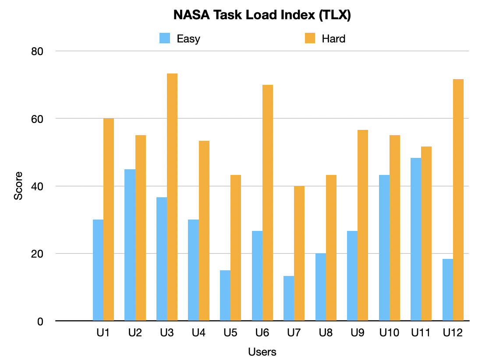
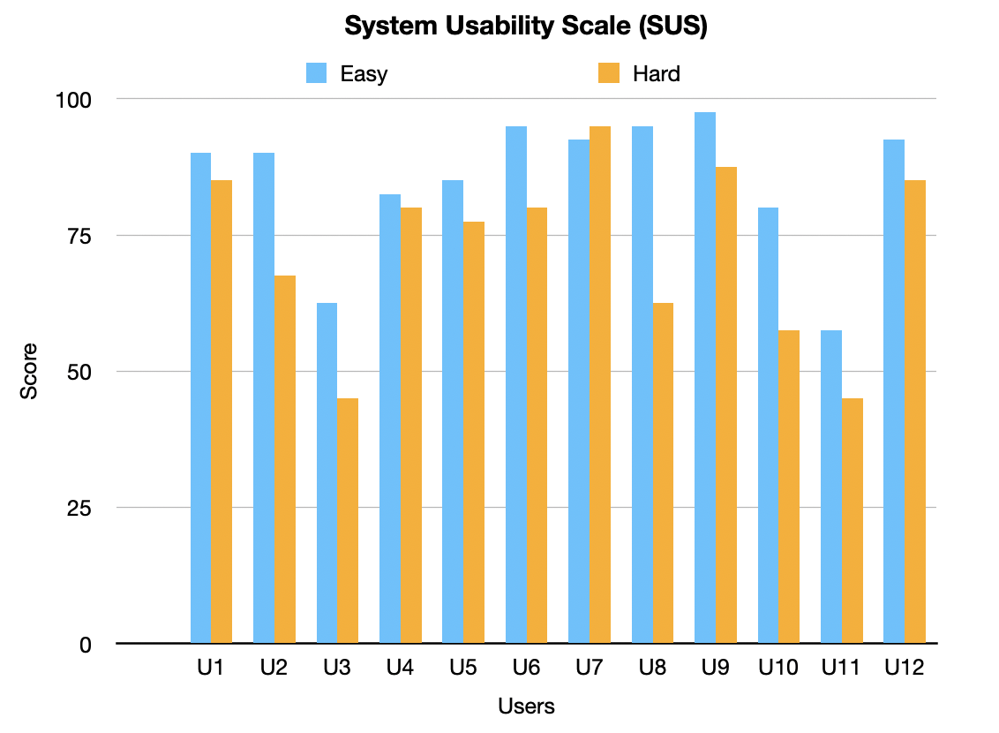

  

- [Evaluation](#evaluation)
    - [Qualitative Evaluations](#qualitative-evaluations)
    - [Quantitative Evaluations](#quantitative-evaluations)
    - [How code was tested](#how-code-was-tested)

# Evaluation

Our team conducted a comprehensive evaluation process, incorporating both qualitative and quantitative evaluations, to assess and improve our game's usability and performance throughout its development. Instead of performing one qualitative and one quantitative evaluation, as per the original requirement, we decided to conduct two of each to gain more practical experience and in-depth understanding.

### Qualitative Evaluations

We conducted Think Aloud Evaluations and Heuristic evaluations at three stages throughout the development process.

<strong>Stage 1</strong>:

At this stage, we had our base game with a start page for choosing characters and a game over page. We set up two tasks for users to perform:

1. Choose a character.
2. Play the game until reaching a score of 100. 

From the Think Aloud Evaluations(<a href="../static/evaluations/qualitative_evaluation/Think_Aloud/Stage-1.pages">raw data</a>), we identified the following issues:

- Users were unsure how to choose a character, so we added a dialog with instructions.
- Users found the game too easy, prompting us to add three difficulty levels.
- Users struggled at the start of the game, so we added a platform under the doodler to provide enough time for users to react.

The Heuristic Evaluation(<a href="../static/evaluations/qualitative_evaluation/Heuristic/Stage-1.pages">raw data</a>) highlighted that the game violated the heuristic "Help and documentation," so we added a help page for detailed instructions.

<strong>Stage 2</strong>:

At this stage, we added different difficulty levels, twists, and made modifications based on the feedback from the first stage. We set up six different tasks related to the game, which are:
1. Access the help page.
2. Adjust the difficulty level.
3. Achieve score of 150.
4. Pause the game.
5. Return to the home page after the game is over.
6. Engage in a two-player competition.

Based on the Think Aloud Evaluations(<a href="../static/evaluations/qualitative_evaluation/Think_Aloud/Stage-2.pages">raw data</a>), we addressed the following issues:
- Continuous broken platforms causing the game to get stuck. We fixed this by avoiding the occurrence of two continuous platforms.
- Gravity reverse platform inconsistency, which confused users. We changed to one color when in gravity reverse mode.
- Help page exit button and setting page save button incompatible with Windows Operating System. We resolved this by changing to an image instead of using the special character.
- Setting window lacked an exit button, so we added one to improve consistency.
- Users often ignored the function of the spacebar to restart the game, so we capitalized the 'SPACE' word to highlight the function.
- In two-player mode, users did not know who had won the game. We added the image of the sprite to make it clearer.
- The instructions on the help page were not clear enough, so we made modifications based on user feedback.

The Heuristic Evaluation in Stage 2(<a href="../static/evaluations/qualitative_evaluation/Heuristic/Stage-2.pages">raw data</a>) revealed the following issues:

- The game still violated the heuristic "Help and documentation" as it lacked a description of the spring and jetpack features. We added these instructions to the help page.
- An issue related to "Consistency and standards" was identified due to the non-standard save button on the settings page. We resolved this issue along with the compatibility issues mentioned above.
- The lack of an exit button in the settings page violated the heuristic "User control and freedom."
- An issue related to "Flexibility and efficiency of use" was raised, suggesting a key on the keyboard to function as a pause button. We added the 'space' bar to serve this purpose.

<strong>Stage 3</strong>:

The tasks at this stage were the same as the second stage. The Think Aloud Evaluations(<a href="../static/evaluations/qualitative_evaluation/Think_Aloud/Stage-3.pages">raw data</a>) revealed the following issues:

1. In 2 player mode, users were unsure who was playing as Player 1 and Player 2.
2. In 2 player mode, users wanted to add a feature like gravity reverse.
3. In 1 player mode, users wanted to know their previous score.

The Heuristic Evaluation(<a href="../static/evaluations/qualitative_evaluation/Heuristic/Stage-3.pages">raw data</a>) at this stage only revealed one issue related to the heuristic "Recognition rather than recall" since we did not have any prompt showing which sprite was Player 1 and which was Player 2. 

Due to time constraints, we were unable to resolve all the issues identified in this stage, but we determined that these features were worth considering for future updates.

###  Quantitative Evaluations

In our quantitative evaluation, we utilized the System Usability Scale (SUS) and the NASA Task Load Index (TLX) to assess the workload and usability of different levels of difficulty in our game. To efficiently gather feedback, we created <a href="https://docs.google.com/forms/d/1n--beeDPrN-xyo5WdQrB-BVJeVDlw9u0uaZuQQKLqfs/edit?sharingaction=ownershiptransfer&ts=6442a99c">Google Forms</a> and distributed them online, successfully collecting data from 12 respondents.

We conducted a Wilcoxon signed-rank test and discovered a significant difference between the scores of the "easy" and "hard" levels. The SUS yielded a W-value of 1.5, while the NASA TLX produced a W-value of 0. The individual scores for each question in the TLX test were 1.5, 2, 0, 0, 1.5, and 0. The most pronounced difference between the two difficulty levels was found in physical demand, followed by mental demand and effort. The raw data for the NASA and SUS can be found at the following link: <a href="../static/evaluations/quantitative_evaluation">../static/evaluations/quantitative_evaluation</a>.

  <figure>
    
  </figure>
 

  <figure>
    
  </figure>
 

### How code was tested

In developing our Doodle Jump game, we thoroughly tested the code by modifying functions within the code to output relevant information when the mouse cursor interacted with specific locations in the game. This information was logged in a file, allowing us to analyze the log file and identify valid and invalid operations.

The game consists of three main screens: the start screen, the game screen, and the end screen. Each of these screens has various areas that require testing. On the start screen, we focused on five key areas: the help button in the top-left corner, the settings button in the top-right corner, and the three character selection buttons in the center. In the game screen, we considered the two gameplay modes—normal mode and gravity reverse mode,each with its specific constraints on the Doodle character's position. We also tested the placement of the SOS/helping platform, which should appear at a fixed position below the character. Additionally, we examined the pause button's location in the top-right corner to ensure it was easily accessible for the player during critical moments. Finally, on the end screen, we tested the go home button's position requirements.

Our primary testing method was equivalence partitioning, a technique that divides input data into equivalent partitions, where each partition represents a range of input values that should produce the same output. This method enables efficient testing by identifying representative test cases for each partition, reducing the number of test cases required while maintaining test coverage.

For example, in our start page testing, we created the following table to summarize the valid and invalid conditions for the x and y coordinates of the key areas:

<strong> Start page </strong>

| **Category**                  |       | **Condition**      |
| ----------------------------- | ----- | ------------------ |
| valid help button x           | HX_1  | 25 ≤ x ≤ 65        |
| invalid help button x         | HX_2  | x < 25 or x > 65   |
| valid help button y           | HY_1  | 25 ≤ y ≤ 65        |
| invalid help button y         | HY_2  | y < 25 or y > 65   |
| valid setting button x        | SX_1  | 340 ≤ x ≤ 365      |
| invalid setting button x      | SX_2  | x < 340 or x > 365 |
| valid setting button y        | SY_1  | 25 ≤ y ≤ 65         |
| invalid setting button y      | SY_2  | y < 25 or y > 65    |
| valid character selection y   | CSY_1 | 400 ≤ y ≤ 505      |
| invalid character selection y | CSY_2 | y < 400 or y > 505 |
| valid left character x        | LCX_1 | 17 ≤ x ≤ 141       |
| invalid left character x      | LCX_2 | x < 17 or x > 141  |
| valid middle character x      | MCX_1 | 142 ≤ x ≤ 232      |
| invalid middle character x    | MCX_2 | x < 142 or x > 232 |
| valid right character x       | RCX_1 | 233 ≤ x ≤ 400      |
| invalid right character x     | RCX_2 | x < 233 or x > 400 |

<strong> Gameplay </strong>

| **Category**                     |       | **Condition**        |
| -------------------------------- | ----- | -------------------- |
| valid doodle x (normal mode)     | DX_1  | 0 ≤ x ≤ 400          |
| valid doodle y (normal mode)     | DY_1  | y ≥ 0                |
| valid doodle x (Downstairs mode) | DX_2  | 0 ≤ x ≤ 400          |
| valid doodle y (Downstairs mode) | DY_2  | y ≤ 0                |
| invalid doodle x                 | DX_3  | x < 0 or x > 400     |
| valid sos brick x                | SBX_1 | x = doodle's x value |
| valid sos brick y                | SBY_1 | y ≤ doodle's y value |
| invalid sos brick x              | SBX_2 | x ≠ doodle's x value |
| invalid sos brick y              | SBY_2 | y > doodle's y value |
| valid ordinary brick x           | OBX_1 | 0 ≤ x ≤ 400          |
| valid ordinary brick y           | OBY_1 | y ≥ 300         |
| invalid ordinary brick x         | OBX_2 | x < 0 or x > 400     |
| invalid ordinary brick y         | OBY_2 | y < 300     |
| valid pause button x             | SX_1  | 340 ≤ x ≤ 370        |
| invalid pause button x           | SX_2  | x < 340 or x > 370   |
| valid pause button y             | SY_1  | 20 ≤ y ≤ 50          |
| invalid pause button y           | SY_2  | y < 20 or y > 50     |

<strong> Pause Window </strong>

| **Category**                     |       | **Condition**        |
| -------------------------------- | ----- | -------------------- |
| valid continue button x             | CBX_1  | doodle's x-80 ≤ x ≤ doodle's x+80        |
| invalid continue button x           | CBX_2  | x < doodle's x-80 or x > doodle's x+80   |
| valid continue button y             | CBY_1  | doodle's y+30 ≤ y ≤ doodle's y+80          |
| invalid continue button y           | CBY_2  | y < doodle's y+30 or y > doodle's y+80      |
| valid exit button x                 | EX_1  | doodle's x-80 ≤ x ≤ doodle's x+80       |
| invalid exit button x               | EX_2  | x < doodle's x-80 or x > doodle's x+80   |
| valid exit button y                 | EY_1  | y < doodle's y+80 or y > doodle's y+160         |
| invalid exit button y               | EY_2  | y < doodle's y+80 or y > doodle's y+160      |

<strong> end page </strong>

| **Category**                        |       | **Condition**      |
| ----------------------------------- | ----- | ------------------ |
| valid end interface home button x   | EHX_1 | 144 ≤ x ≤ 259      |
| invalid end interface home button x | EHX_2 | x < 144 or x > 259 |
| valid end interface home button y   | EHY_1 | 282 ≤ y ≤ 327      |
| invalid end interface home button y | EHY_2 | y < 282 or y > 327 |

By using equivalence partitioning testing in combination with other testing techniques, we ensured that our game functioned as intended, providing a smooth and enjoyable experience for the players.