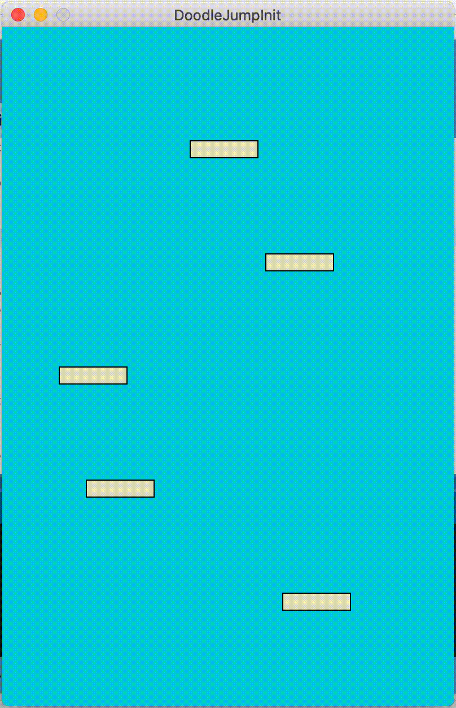
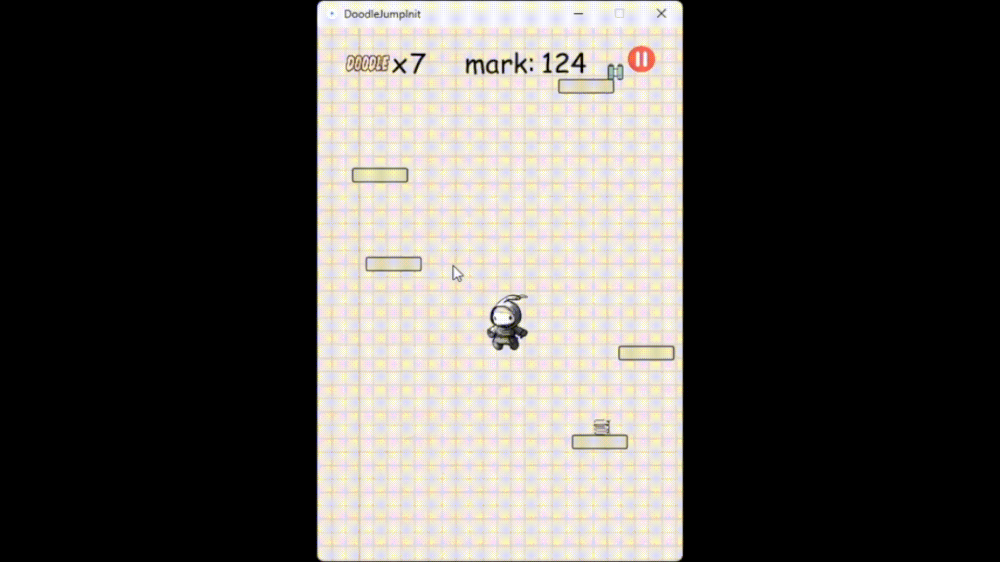
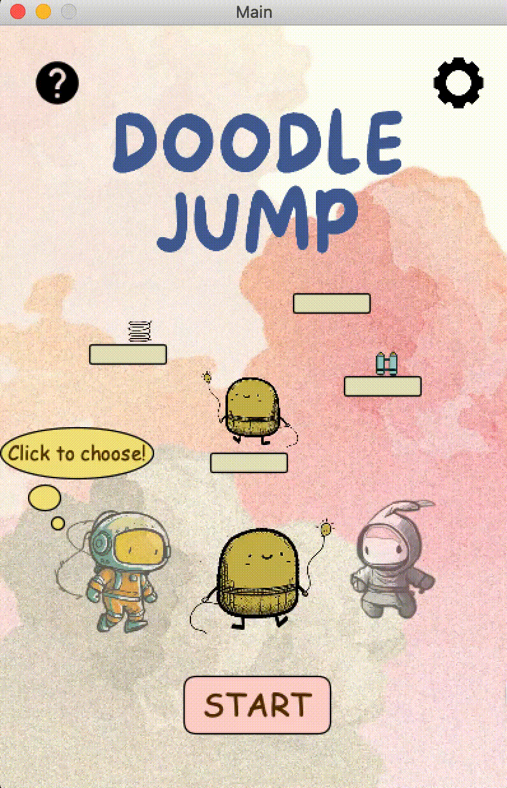
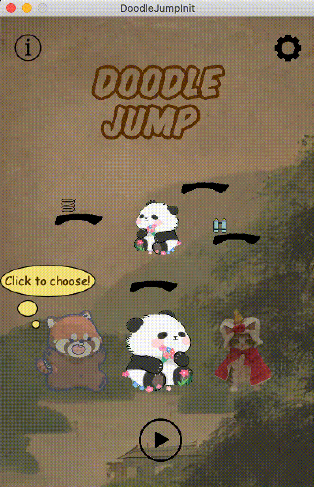

  

- [Implementation](#implementation)
  - [Challenge 1: Platforming Framework](#challenge-1-platforming-framework)
  - [Challenge 2: GamePlay Twists](#challenge-2-gameplay-twists)
  - [Challenge 3: Integration and UI](#challenge-3-integration-and-ui)

# Implementation

## Challenge 1: Platforming Framework
Implementing the early platforming logic of the player character and the surrounding objects proved to be relatively straightforward in their design.  Writing our game in Processing allowed us to straightforwardly generate player characters, manipulate their velocity, and implement simple collision detection between the user and the surrounding platform. The first challenge that emerged in our game implementation was designing the nature of our randomly generated map, in particular, cycling through successfully navigated parts of the map. 

One problem that seemed to emerge among other project groups was the difficulty in translating the map and its obstacles to the movement of the user. Please see the demonstration below.
<figure>
  
  <figcaption> Demonstration of Platforming Framework Challenge </figcaption>
</figure>
 
 
Our game structure navigated these problems by ensuring that the platform entities (and in turn the equipment and monster entities) were all instantiated within the Doodler class. This allowed us to manipulate these objects in a way that responded to the current configuration of the player character. This also presented a novel solution to a secondary problem that immediately impacted platforming performance and memory allocation. When the map failed to adequately react to the movement of the player the large number of platform, equipment, and monster entities being spawned caused map generation errors, hardware lag, and eventual crashing. By successfully implementing a reactive map generation process, our software was able to identify when parts of the map had been successfully traversed and were therefore being rendered off-screen. In doing so we were able to purge navigated entities that no longer needed to be rendered ensuring a smooth, efficient game execution.

## Challenge 2: GamePlay Twists
Having implemented a basic platforming method that represented the underlying framework for the rest of our software, the next development challenge was the incorporation of the gameplay twist elements. Developing our two-player game mode presented several challenges, particularly in its integration with the base game model.

The two-player method required tweaking how user inputs were registered, allowing for multiple key presses and directional changes among the two users. Creating this alternate game state for two players also required a careful rebalancing of equipment objects. Preliminary feedback recognised that powerful changes to a doodle’s velocity and map position, which caused games to end prematurely, threatened the fairness and enjoyment of the game mode. As a result, alterations were made to interactions with equipment to lessen their impact and the method behind map generation was altered slightly to favour whichever doodle was traversing fastest.

We also encountered a challenge while generating a helping platform in our game. Initially, when we tried to create a platform by pressing the Z key, multiple platforms were appearing on the map. It took us a considerable amount of time to identify the root cause of this issue. Eventually, we discovered that the problem was arising due to the ArrayList used to store the platform. To overcome this challenge, we replaced the new platform in the correct position within the ArrayList, which resolved the issue.

<figure>
  
  <figcaption>Demonstration of Helping platform challenge. The platforms circled in red represent the unusually generated platforms </figcaption>
</figure>
 
 

## Challenge 3: Integration and UI
In addition to the two-player mode, we aimed to develop and refine two other gameplay twists: reversed gravity mode and user-controlled map layout. The final challenge involved integrating these separate components into a cohesive product. It was crucial to develop a clean and readable codebase for developers while ensuring an intuitive user interface for players. Another consideration was structuring the game difficulty to account for the impact of gameplay twists and map enemies on the overall challenge.

To address these concerns, we designed a layered interface that enabled users to select between single and multiplayer modes and adjust map difficulty. Each incremental difficulty level would introduce a new, more challenging gameplay twist. This approach allowed us to communicate gameplay twists effectively and provide players with the flexibility to customize their experience according to their preferences and skill level.

<figure>
  
  <figcaption>Level Difficulty Selection and One-Player and Two-Player Modes </figcaption>
</figure>
 
 

Furthermore, we invested considerable time in refining the visual design and layout of our user interface. This process involved crafting clear and concise menus, easily identifiable buttons and icons, as well as a visually appealing color scheme and distinct platform patterns that remained consistent throughout the game. We developed two UI designs and held a vote, taking into consideration our primary goal: ensuring that players could quickly understand and navigate the various options and settings available to them, without feeling overwhelmed or confused. By selecting the most user-friendly design, we prioritized creating an enjoyable and seamless gaming experience for our players.

| Design 1                        | |Design 2                      | 
| --------------------------      |-|------------------------------| 
|  | | |

After a thorough evaluation and voting process, we chose Design 1 for our user interface. The key factor behind this choice was the distinct platform patterns in Design 1. Although Design 2 employed a creative and visually appealing approach by using Chinese calligraphy to represent different types of platforms, it ultimately proved to be less user-friendly. Players found it difficult to distinguish between the various fonts and corresponding platforms, which hindered the overall gameplay experience. 
