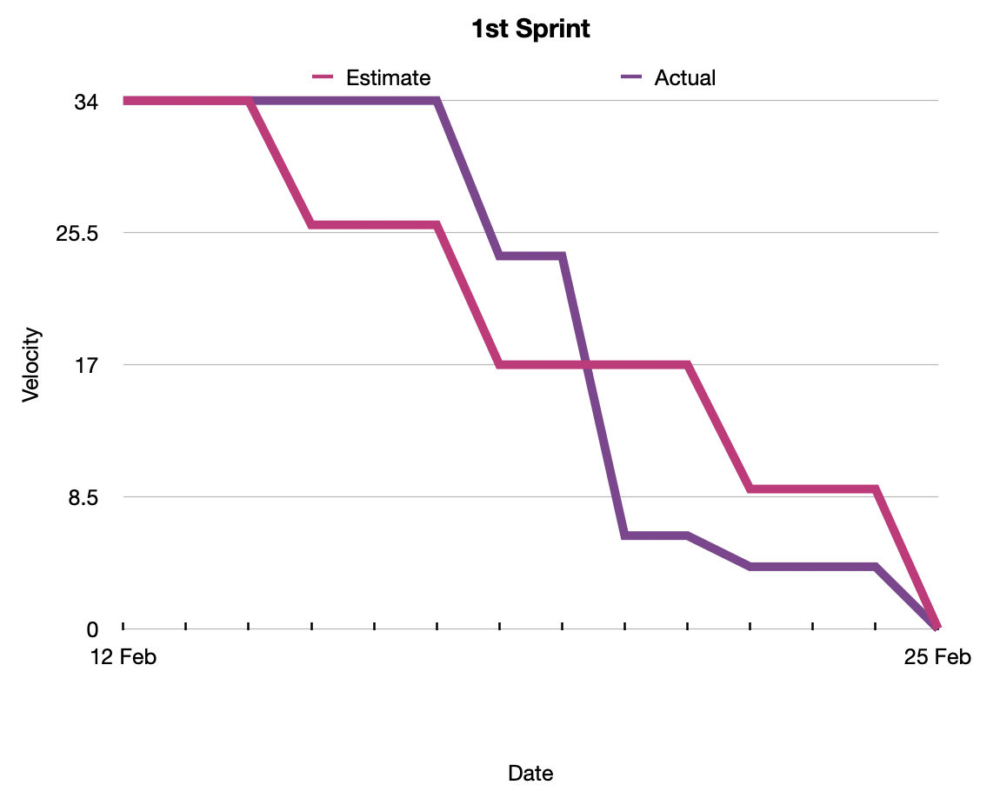
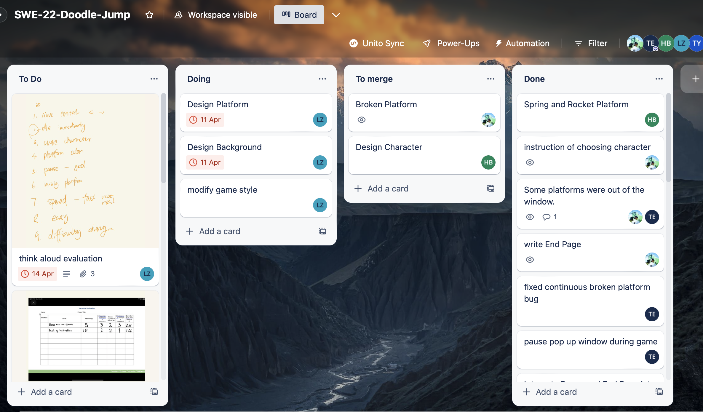
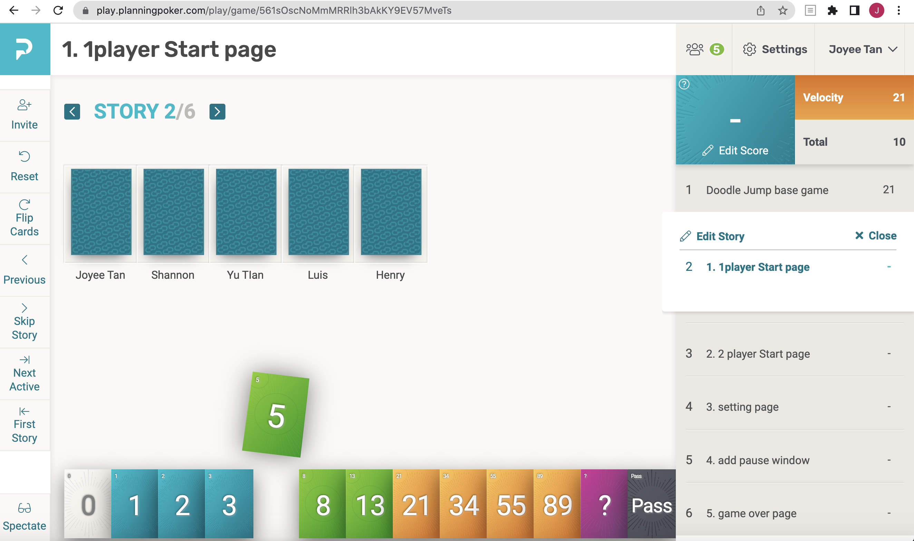
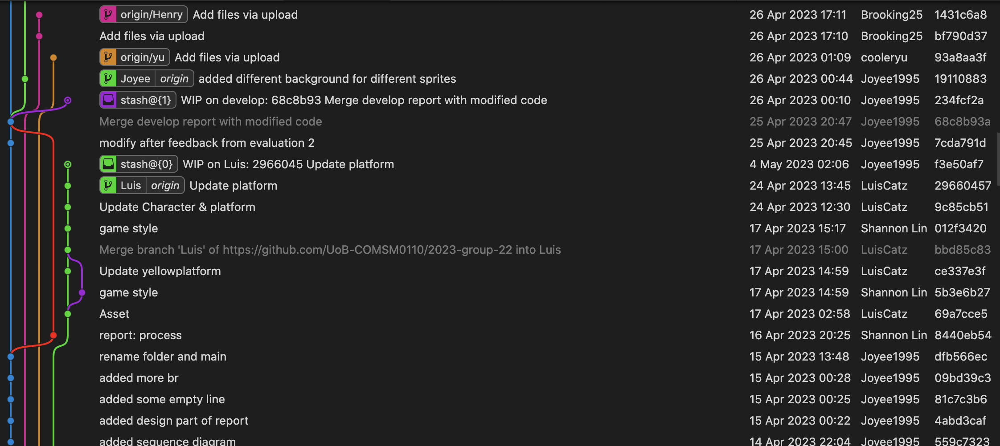

  

- [Process](#process)

# Process

In developing our game, our goal was not only to create an enjoyable and engaging experience for players but also to thoroughly understand and apply the principles of good software engineering. To achieve this, our team embraced the Agile methodology and integrated its key principles into our workflow.

Our team consisted of five members: Joyee, Shannon, Henry, Yu, and Luis. Each member took on specific roles and responsibilities to ensure a well-structured and efficient workflow:

1. Joyee: Main project manager and lead developer, overseeing the overall progress, integrating the work of other developers, and merging the code when a team member moved a task to "To merge" on the Trello board.
2. Shannon: Vice project manager and main developer, collaborating with Joyee in project management, sharing decision-making responsibilities, and contributing to development.
3. Henry: Main developer and sprite designer, responsible for implementing game features and creating visual assets.
4. Yu: Developer and tester, handling a smaller part of development and ensuring the quality of the final product.
5. Luis: Game style and evaluation lead, focusing on the game's aesthetics, user experience, and performance assessment.

Our Agile approach involved dividing the project into three life cycles, each representing a phase or a major milestone. Within each life cycle, we organized multiple sprints to iteratively develop features, fix bugs, and make improvements. For each sprint, we utilized planning poker during sprint planning meetings to estimate the effort required for the tasks in the upcoming sprint. This approach helped us maintain adaptability, respond to changes quickly, and foster a continuous improvement mindset.

Throughout the project, we encountered situations where certain team members were unable to complete their assigned story points within a sprint. In order to tackle this challenge, we refined our sprint planning process and updated the burn chart accordingly.

During the first sprint, we established a velocity that we assumed could be maintained in the second sprint. However, this assumption proved to be inaccurate, as the team's actual performance in the second sprint fell short of our expectations. Consequently, we decided to lower the velocity for the third sprint.
In contrast, the last sprint took place during Easter week, prompting us to increase the velocity to account for the boost in productivity.

Please refer to the chart below for a visual representation of our adjusted velocity:
 
<figure>
  
  <figcaption>1st Sprint Burn Chart: The team's initial velocity during the first sprint. This chart served as a baseline for subsequent sprints.</figcaption>
</figure>
 
<figure>
  
  <figcaption>2nd Sprint Burn Chart: The team's actual performance fell short of expectations in the second sprint.</figcaption>
</figure>
 
<figure>
  
  <figcaption>3rd Sprint Burn Chart: The team lowered the velocity for the third sprint to improve performance.</figcaption>
</figure>
 
<figure>
  
  <figcaption>4th Sprint Burn Chart: The team increased the velocity for the fourth sprint due to a boost in productivity during Easter week.</figcaption>
</figure>
 
 
By making these modifications, we were able to establish a more accurate project timeline and allocate resources more effectively. As a result, the team continued to make steady progress throughout the project, ensuring that our goals remained achievable and within reach.
 
 
For a comprehensive overview of the burn charts and associated tasks, please access the raw data via the following link: <a href="../static/burn_chart/Burn_Chart.numbers">../static/burn_chart/Burn_Chart.numbers</a>.
 
 
We used Trello as our Kanban board to visualize and manage tasks, allowing us to monitor progress and make adjustments as needed. By incorporating planning poker in each sprint, we ensured a shared understanding of task complexity among team members, encouraged them to voice their opinions, and facilitated communication and collaboration.

 
<figure>
  
  <figcaption>Trello interface</figcaption>
</figure>
 
 
<figure>
  
  <figcaption>Planning Poker interface</figcaption>
</figure>
 
 

After completing the planning poker, we allocated story points to each team member based on their capacity, skills, and availability, as well as the insights gained from the previous burn chart. This allowed us to balance the workload effectively and ensure that each team member was allocated tasks that matched their skills and availability. This practice also helped us monitor the team's progress and make adjustments as needed to stay on track.

Although we did not hold daily stand-up meetings, our team stayed in constant communication through social media platforms like WhatsApp and Microsoft Teams. This allowed us to discuss any obstacles encountered, seek support from the team, and share updates on our progress. Our consistent communication ensured that everyone was aligned with the project goals and fostered a collaborative environment.

To further facilitate collaboration and maintain an Agile mindset, we utilized pair programming sessions, which involved two developers working together on the same code. For instance, the reverse gravity feature was developed jointly by Joyee and Shannon, with Joyee taking on the role of the helm while Shannon acted as the tactician. This practice not only improved the quality of our code but also allowed us to share knowledge and learn from each other.

Complementing this approach, our team made extensive use of Git's branch and merge features to distinguish between individual members' code versions. Each team member developed new features on their personal branches, and Joyee was responsible for integrating them into the 'develop' branch. Once thorough testing was completed, the 'develop' branch was merged into the 'master' branch, ensuring it contained only working components. The accompanying diagram clearly demonstrates that each team member had their own branch, further empowering them to contribute to the repository independently.

 
<figure>
  
  <figcaption>Git Graph</figcaption>
</figure>
 
 

Throughout the project, we implemented regular feedback loops by conducting evaluations at each stage of the life cycles. This enabled us to continuously assess our game's quality and make necessary improvements based on user feedback and performance metrics. Our Agile approach emphasized the importance of incorporating user feedback, allowing us to create a game that is engaging and enjoyable for players.

As a result of our Agile process, which included organizing our work into three life cycles with multiple sprints and utilizing planning poker in each sprint, our team was able to effectively manage tasks, address challenges, and adapt to changes. This, in turn, led to the successful development of our game while maintaining a strong focus on good software engineering practices.

To sum up, our team's commitment to the Agile methodology, including planning poker and story point allocation, played a crucial role in the successful completion of our project. We learned the value of iterative development, continuous improvement, and open communication in managing a complex software development process. These lessons have not only contributed to our game's quality but have also shaped our understanding of effective software engineering practices, which will undoubtedly benefit us in future projects.
