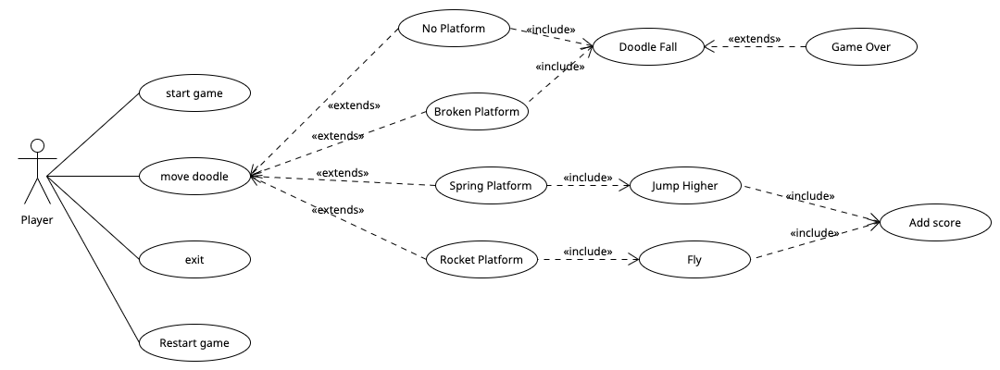
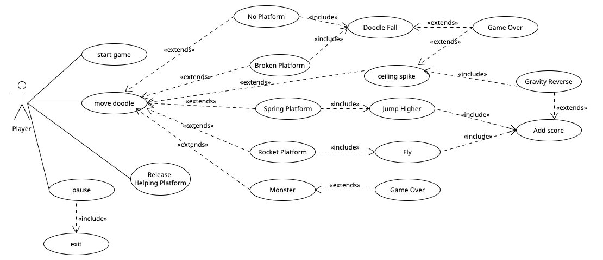

  

- [Requirements](#requirements)
  - [Ideation Process](#ideation-process)
  - [Early Stages Design](#early-stages-design)
  
# Requirements

## Ideation Process
During the ideation process, our team focused on brainstorming potential game ideas that met specific constraints to ensure that the game we created was feasible to develop, had good user appeal, and adhered to specific constraints.

To better understand what users may be interested in, we started by creating user stories. 

>"As young student, I want a game that is easy to undestand and yet challenging to play during my break time."

>"As a working professional, I want a game doesn't require internet connection, playable with one hand, quick, fun, and engaging game to play during commute."

>"As a college student, I want a game that can be played in short bursts, fitting it into my limited free time between classes."

>"As a game designer, I want to create a game that offers a blend of classic and modern gameplay elements, appealing to a wide range of preferences and tastes."

To adhere to these constraints, we generated five game ideas, including chess, checkers, flappy bird, temple run, and doodle jump. We then evaluated these ideas based on their features, technical feasibility, and potential appeal to users.

We considered several features during our evaluation process, including whether the game was static or dynamic and whether it relied on strategy or reflexes. After careful consideration and by creating more user stories, 

>"As a single player, I want to be able to enjoy a game without relying on other players."

>"As a player, I want a game that are challenging and require different levels of skill and strategy to master."

>"As a player, I want a game that introduces new mechanics as I progress, maintaining my interest and increasing the challenge."

>"As a player, I want a game that responds to my actions in real-time, providing me with immediate feedback and a sense of immersion."

>"As a player, I want a game that offers unpredictability and variety in gameplay, keeping me engaged and preventing boredom."

>"As a player, I want a game that constantly evolves and presents new challenges, ensuring that the gameplay remains fresh and engaging over time."

we eliminated the two static game ideas and opted for a dynamic and reflex-based game that we believed would be more appealing to users.

Next, we evaluated the remaining game ideas' technical feasibility and concluded that Doodle Jump was the most feasible game to develop. This is because of its simple mechanics where the player only needs to jump from one platform to another, which does not require complex physics simulations or pathfinding algorithms like Temple Run or Flappy Bird. Doodle Jump also has a minimalist art style that doesn’t require detailed graphics or animations, which makes it easier for developers to create the necessary assets for the game. The game also only scrolls vertically, reducing the technical complexity of implementing scrolling.

After choosing Doodle Jump as our final game, we brainstormed possible twists to make it more engaging. We settled on three ideas: Dynamic Map Manipulation (Helping/SOS Platform), Gravity Inversion, and Two-Player PK Mode.

- Dynamic Map Manipulation (Helping/SOS Platform) introduces an interactive element, allowing players to adapt to changing environments and encouraging strategic thinking. It also provides agency and rewards quick decision-making, enhancing overall replayability.
  
- Gravity Inversion makes the game more challenging and unpredictable, requiring players to adjust their playstyle and reflexes. This twist also adds a unique gameplay mechanic that sets the game apart from others in the genre, appealing to players seeking fresh experiences.
  
- Two-Player PK (Player Kill) Mode adds variety and fosters social interaction and rivalry. PK mode encourages players to refine their skills and strategies, competing for high scores or head-to-head battles.
  
These three twists enhance the overall gameplay experience by adding depth, challenge, and variety, making the game more thrilling, engaging, and appealing to a broader audience.

## Early Stages Design

Once we decided on creating a game based on Doodle Jump with three twists, we began the early stages of design. Our first step was to identify the core game mechanics and functionality needed for the game. We conducted research with paying particular attention to games with similar mechanics to Doodle Jump. This research helped us to identify the key game mechanics we needed to incorporate, such as jumping and avoiding obstacles.

Next, we developed a use case diagram to help us visualize the core use cases and actors involved in the game. This diagram helped us to identify the primary use cases and actors, and how they interacted with one another. We included the use cases for the basic version of Doodle Jump, as well as the three twists we planned to add. We also identified the actors involved in the game, including the player, broken platforms and monsters.
<figure>
  
  <figcaption>Base Game Use Case Diagram</figcaption>
</figure>

<figure>
  
  <figcaption>Use Case Diagram with Twist</figcaption>
</figure>
 
 
After developing the use case diagram, we created a paper prototype of the game.

<figure>
  
  <figcaption>Paper Prototype</figcaption>
</figure>
 
 
This prototype helped us to refine our design ideas and potential game mechanics. We experimented with different layouts, color schemes, and gameplay options to see what worked best. We also discussed and identified any potential issues or improvements. Through this process, we were able to make the necessary adjustments and refine our game design.

One of the key challenges we faced during the early stages of design was balancing the difficulty level of the game. We wanted the game to be challenging enough to keep players engaged, but not so difficult that it would frustrate them. We experimented with different platforms, monsters, and gameplay mechanics to find the right balance.

Overall, the early stages of design were crucial in helping us polish our game concept and identify the key features and functionality required for our game. By developing a use case diagram and a paper prototype, we were able to visualize the necessary game mechanics and implement our design ideas. This process helped us to create a solid foundation for the development of our game.
